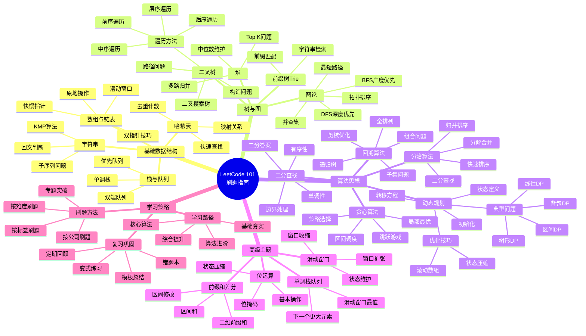

# LeetCode 101 力扣刷题指南 - 知识总结文档

## 文档概览

《LeetCode 101：力扣刷题指南》是一本面向有一定编程基础但缺乏刷题经验的读者的算法学习指南，提供C++和Python双语言题解，旨在帮助读者系统性地掌握算法和数据结构知识，为技术面试做好准备。

---

## 核心定位与目标读者

### 目标读者画像
- 具备基本编程能力（C++或Python）
- 对数据结构和算法有初步了解
- 缺乏系统性刷题经验
- 准备参加技术面试或竞赛

### 学习目标
- 建立完整的算法知识体系
- 掌握常见算法模式和解题技巧
- 提高代码实现能力
- 培养算法思维和问题抽象能力

---

## 知识体系架构

### 一、基础数据结构篇

#### 1.1 数组与链表
**核心概念**
- 数组的特性：连续存储、随机访问O(1)
- 链表的特性：非连续存储、插入删除O(1)
- 双指针技巧：快慢指针、对撞指针、滑动窗口

**典型问题类型**
- 数组反转与旋转
- 链表反转与合并
- 环形链表检测
- 数组去重与原地修改

**关键技巧**
- 原地操作减少空间复杂度
- 虚拟头节点简化边界处理
- 双指针优化时间复杂度
- 快慢指针找中点、检测环

#### 1.2 栈与队列
**核心概念**
- 栈：后进先出（LIFO）特性
- 队列：先进先出（FIFO）特性
- 单调栈：维护单调性的栈结构
- 优先队列：基于堆实现的队列

**典型问题类型**
- 括号匹配问题
- 表达式求值
- 单调栈求下一个更大/更小元素
- 滑动窗口最大值

**关键技巧**
- 利用栈保存中间状态
- 单调栈维护递增/递减序列
- 双端队列优化滑动窗口
- 优先队列解决Top K问题

#### 1.3 哈希表
**核心概念**
- 哈希函数与哈希冲突
- 空间换时间的思想
- 集合（Set）与映射（Map）

**典型问题类型**
- 两数之和类问题
- 字符串/数组去重
- 频率统计问题
- 同构字符串判断

**关键技巧**
- 利用哈希表快速查找
- 双哈希表处理双向映射
- 前缀和+哈希优化子数组问题
- 计数器处理频率问题

#### 1.4 字符串
**核心概念**
- 字符串匹配算法
- 回文判断
- 子序列与子串
- 字符串编辑

**典型问题类型**
- KMP算法与字符串匹配
- 最长回文子串
- 最长公共子序列
- 字符串编辑距离

**关键技巧**
- 双指针处理回文
- 动态规划解决子序列问题
- 滑动窗口处理子串问题
- 字符统计与映射

---

### 二、树与图结构篇

#### 2.1 二叉树
**核心概念**
- 二叉树的遍历：前序、中序、后序、层序
- 二叉搜索树（BST）性质
- 平衡二叉树概念
- 完全二叉树与满二叉树

**典型问题类型**
- 树的遍历（递归与迭代）
- 树的构造与重建
- 路径和问题
- 公共祖先问题
- BST的增删查改

**关键技巧**
- 递归思维：分治与回溯
- 层序遍历使用队列
- 中序遍历BST得到有序序列
- 前序+中序或后序+中序重建树
- 树的序列化与反序列化

#### 2.2 堆
**核心概念**
- 大顶堆与小顶堆
- 堆的性质：父节点与子节点关系
- 堆的操作：插入、删除、调整

**典型问题类型**
- Top K问题
- 中位数维护
- 数据流中的第K大元素
- 合并K个有序链表/数组

**关键技巧**
- 使用小顶堆维护最大的K个元素
- 使用大顶堆维护最小的K个元素
- 双堆维护中位数
- 优先队列优化多路归并

#### 2.3 前缀树（Trie）
**核心概念**
- 字典树结构
- 前缀匹配特性
- 空间与时间权衡

**典型问题类型**
- 单词搜索
- 自动补全
- 最长公共前缀
- 单词拆分

**关键技巧**
- 树形结构存储字符串
- 公共前缀共享节点
- 标记单词结束位置
- DFS/BFS搜索路径

#### 2.4 图论基础
**核心概念**
- 图的表示：邻接矩阵、邻接表
- 图的遍历：DFS、BFS
- 有向图与无向图
- 连通性与强连通分量

**典型问题类型**
- 岛屿数量问题
- 课程表问题（拓扑排序）
- 最短路径问题
- 克隆图
- 判断图是否为树

**关键技巧**
- DFS处理连通性问题
- BFS求最短路径
- 拓扑排序检测环
- 并查集判断连通性
- Dijkstra/Floyd最短路径算法

---

### 三、算法思想篇

#### 3.1 贪心算法
**核心思想**
- 局部最优导致全局最优
- 证明贪心选择性质
- 验证最优子结构

**典型问题类型**
- 区间调度问题
- 跳跃游戏
- 分发糖果
- 股票买卖最佳时机
- 加油站问题

**关键技巧**
- 排序后贪心选择
- 反证法验证贪心策略
- 局部最优的累积
- 边界条件的处理

**贪心策略选择原则**
- 按结束时间排序（区间调度）
- 按开始时间排序（会议室问题）
- 按价值密度排序（背包问题变种）
- 优先选择收益最大/损失最小

#### 3.2 分治算法
**核心思想**
- 分解：将问题分解为子问题
- 解决：递归解决子问题
- 合并：合并子问题的解

**典型问题类型**
- 归并排序
- 快速排序
- 二分查找
- 最大子数组和
- 最近点对问题

**关键技巧**
- 确定分解方式
- 设计合并策略
- 处理基础情况
- 分析时间复杂度（主定理）

**分治问题特征**
- 可分解为相似的子问题
- 子问题之间相对独立
- 可以高效合并子问题的解
- 递归深度可控

#### 3.3 动态规划
**核心思想**
- 最优子结构
- 重叠子问题
- 状态定义与转移
- 记忆化搜索与迭代实现

**典型问题类型**
| 问题分类 | 代表问题 | 状态特征 |
|---------|---------|---------|
| 线性DP | 爬楼梯、打家劫舍 | 一维状态 |
| 区间DP | 最长回文子串、矩阵链乘法 | 区间端点 |
| 背包DP | 0-1背包、完全背包、多重背包 | 容量+物品 |
| 树形DP | 树的直径、打家劫舍III | 树节点+状态 |
| 状态压缩DP | 旅行商问题、子集枚举 | 位掩码 |
| 数位DP | 数字统计问题 | 位数+限制 |

**关键技巧**
- 明确状态定义
- 找出状态转移方程
- 确定初始状态和边界
- 选择合适的遍历顺序
- 空间优化：滚动数组、状态压缩

**动态规划解题步骤**
1. 定义状态：`dp[i]`或`dp[i][j]`代表什么
2. 找出状态转移方程
3. 初始化边界条件
4. 确定计算顺序
5. 返回最终答案

**优化技巧**
- 滚动数组优化空间（一维DP）
- 前缀和/差分优化时间
- 单调队列优化决策
- 四边形不等式优化区间DP

#### 3.4 回溯算法
**核心思想**
- 深度优先搜索
- 尝试所有可能性
- 剪枝优化

**典型问题类型**
- 全排列问题
- 组合问题
- 子集问题
- N皇后问题
- 数独求解
- 括号生成

**关键技巧**
- 递归树的构建
- 回溯的时机（撤销选择）
- 剪枝条件的设计
- 去重策略
- 结果的收集

**回溯模板**
```
解题框架：
1. 定义路径（已做选择）
2. 定义选择列表（当前可选项）
3. 定义结束条件
4. 实现递归逻辑：
   - 做选择
   - 递归
   - 撤销选择
```

**剪枝策略**
- 可行性剪枝：不满足约束条件
- 最优性剪枝：不可能得到更优解
- 重复性剪枝：避免重复搜索
- 顺序剪枝：按特定顺序搜索

#### 3.5 二分查找
**核心思想**
- 有序性或单调性
- 每次排除一半搜索空间
- 左右边界的维护

**典型问题类型**
- 基本二分查找
- 搜索旋转排序数组
- 查找第一个/最后一个位置
- 二分答案（最大化最小值、最小化最大值）
- x的平方根

**关键技巧**
- 确定搜索空间和单调性
- 正确处理边界条件
- 选择合适的中点计算方式
- 区分查找值、查找插入位置、查找边界

**二分查找变体**
| 变体类型 | 左边界更新 | 右边界更新 | 返回值 |
|---------|-----------|-----------|--------|
| 精确查找 | left = mid + 1 | right = mid - 1 | mid或-1 |
| 查找左边界 | left = mid + 1 | right = mid | left |
| 查找右边界 | left = mid | right = mid - 1 | right |
| 查找插入位置 | left = mid + 1 | right = mid - 1 | left |

---

### 四、高级主题篇

#### 4.1 位运算
**核心概念**
- 基本位运算：与、或、非、异或、移位
- 位运算的性质与技巧
- 位掩码的应用

**典型问题类型**
- 位1的个数
- 幂运算
- 只出现一次的数字
- 比特位操作
- 状态压缩

**常用技巧**
| 操作 | 表达式 | 说明 |
|------|--------|------|
| 判断奇偶 | x & 1 | 结果为1是奇数 |
| 除以2 | x >> 1 | 右移一位 |
| 乘以2 | x << 1 | 左移一位 |
| 清除最低位1 | x & (x-1) | 消除最右边的1 |
| 获取最低位1 | x & (-x) | 提取最右边的1 |
| 判断2的幂 | x & (x-1) == 0 | 只有一个1 |
| 交换两数 | a ^= b; b ^= a; a ^= b | 无需临时变量 |

#### 4.2 并查集
**核心概念**
- 不相交集合的合并与查询
- 路径压缩优化
- 按秩合并优化

**典型问题类型**
- 判断图的连通性
- 朋友圈问题
- 岛屿数量
- 等式方程的可满足性

**关键技巧**
- find操作：查找根节点
- union操作：合并集合
- 路径压缩：优化查找
- 按秩合并：平衡树高

**并查集模板结构**
- 初始化：每个元素的父节点指向自己
- 查找：递归找到根节点，同时压缩路径
- 合并：将一个集合的根连接到另一个集合的根
- 优化：按秩合并（按size或rank）

#### 4.3 滑动窗口
**核心思想**
- 维护一个可变长度的窗口
- 窗口扩张与收缩的条件
- 双指针技巧的应用

**典型问题类型**
- 最小覆盖子串
- 无重复字符的最长子串
- 找到字符串中所有字母异位词
- 长度最小的子数组

**关键技巧**
- 右指针扩张窗口
- 左指针收缩窗口
- 使用哈希表维护窗口状态
- 更新答案的时机

**滑动窗口模板**
```
框架步骤：
1. 初始化左右指针
2. 右指针移动，扩大窗口
3. 更新窗口状态
4. 判断是否需要收缩窗口
5. 左指针移动，缩小窗口
6. 更新答案
```

#### 4.4 单调栈/单调队列
**核心概念**
- 维护栈/队列的单调性
- 快速找到下一个更大/更小元素
- O(n)时间复杂度处理序列问题

**典型问题类型**
- 下一个更大元素
- 柱状图中最大的矩形
- 滑动窗口最大值
- 接雨水问题

**关键技巧**
- 单调递增栈：找下一个更小元素
- 单调递减栈：找下一个更大元素
- 双端队列维护滑动窗口极值
- 栈中存储索引而非值

#### 4.5 前缀和与差分
**核心思想**
- 前缀和：快速求区间和
- 差分：快速进行区间修改
- 空间换时间

**典型问题类型**
- 子数组和等于K
- 二维区域和检索
- 区间加法
- 航班预订统计

**关键技巧**
- 前缀和数组预处理
- 区间和 = 前缀和之差
- 差分数组处理区间修改
- 前缀和+哈希表优化

**前缀和应用场景**
- 一维前缀和：数组区间和
- 二维前缀和：矩阵区域和
- 前缀积：乘积区间
- 前缀异或：异或区间

---

## 学习方法与刷题策略

### 系统学习路径

#### 第一阶段：基础夯实（1-2周）
**学习重点**
- 掌握基本数据结构：数组、链表、栈、队列、哈希表
- 理解时间复杂度和空间复杂度
- 熟悉基本算法：排序、查找、递归

**练习建议**
- 每类数据结构刷5-10道基础题
- 重点掌握基本操作和常见技巧
- 从简单题开始，循序渐进

#### 第二阶段：算法进阶（2-3周）
**学习重点**
- 树的遍历和常见操作
- 图的基本算法（DFS、BFS）
- 二分查找及其变体
- 双指针和滑动窗口技巧

**练习建议**
- 树的题目侧重递归思维
- 图的题目理解遍历过程
- 二分查找注意边界条件
- 双指针题目总结移动规律

#### 第三阶段：核心算法（3-4周）
**学习重点**
- 动态规划：从简单到复杂
- 回溯算法：全排列、组合、子集
- 贪心算法：掌握常见贪心策略
- 分治算法：理解递归结构

**练习建议**
- 动态规划先刷经典题型
- 回溯算法画递归树理解
- 贪心算法多思考证明过程
- 每种算法刷15-20道题

#### 第四阶段：综合提升（持续）
**学习重点**
- 高级数据结构：堆、Trie、并查集
- 位运算技巧
- 单调栈/队列应用
- 前缀和与差分

**练习建议**
- 针对薄弱环节强化练习
- 参加周赛提升速度
- 复习已做过的题目
- 总结题型和解法模板

### 刷题技巧

#### 题目选择策略
1. **按标签刷题**：集中攻克某一类型
2. **按难度刷题**：简单→中等→困难，循序渐进
3. **按公司刷题**：针对目标公司的高频题
4. **按专题刷题**：系统学习某个算法思想

#### 做题流程
1. **理解题意**：仔细读题，明确输入输出和约束条件
2. **思考方法**：不要着急写代码，先想清楚思路
3. **画图分析**：复杂问题画图辅助思考
4. **编写代码**：注意边界条件和特殊情况
5. **测试验证**：用例子验证代码正确性
6. **复杂度分析**：分析时间和空间复杂度
7. **优化改进**：思考是否有更优解法

#### 遇到难题的处理
- **看10-15分钟**：先独立思考，尝试暴力解法
- **看题解思路**：理解核心思想，不要直接抄代码
- **自己实现**：根据思路独立编写代码
- **多次复习**：1天后、3天后、1周后再做一遍
- **变式练习**：找类似题目巩固理解

#### 总结与复盘
- **建立错题本**：记录易错点和解题技巧
- **整理模板**：总结常见算法的代码模板
- **画思维导图**：梳理知识体系和题型关系
- **定期回顾**：温故而知新，巩固记忆

### 时间管理建议

#### 每日学习计划
- **工作日**：1-2小时，1-2道题
- **周末**：3-4小时，3-5道题
- **建议时间分配**：
  - 30%：新题学习
  - 40%：专题练习
  - 30%：复习巩固

#### 阶段性目标
- **1个月**：完成100道简单+中等题
- **2个月**：掌握核心算法和数据结构
- **3个月**：能够独立解决大部分中等题
- **半年**：可以尝试困难题，参加周赛

---

## 常见问题与解决方案

### Q1: 如何判断应该用什么算法？

**问题特征识别**
| 问题特征 | 推荐算法/数据结构 |
|---------|-----------------|
| 需要快速查找、去重 | 哈希表 |
| 需要维护有序性 | 二叉搜索树、堆 |
| 需要最近访问的元素 | 栈、队列 |
| 区间问题、排序相关 | 双指针、滑动窗口 |
| 路径、组合、排列 | 回溯、DFS |
| 最短路径、层级遍历 | BFS |
| 最优解、计数问题 | 动态规划 |
| 局部最优选择 | 贪心 |
| 有单调性、二段性 | 二分查找 |
| 连通性、集合合并 | 并查集 |

### Q2: 动态规划状态定义不出来怎么办？

**解决步骤**
1. **从暴力递归开始**：先写出递归解法
2. **观察重复子问题**：找出哪些计算被重复
3. **定义状态变量**：递归参数通常就是状态
4. **记忆化搜索**：添加缓存，避免重复计算
5. **转化为迭代**：自底向上填表

**常见状态定义模式**
- `dp[i]`：前i个元素的最优解
- `dp[i][j]`：区间[i,j]或前i个元素选j个的最优解
- `dp[i][j][k]`：三维状态，多一个约束条件

### Q3: 如何提高代码实现能力？

**提升方法**
1. **熟练掌握语言特性**：STL、内置函数、语法糖
2. **背诵常用模板**：排序、二分、遍历等
3. **注重代码规范**：变量命名、注释、缩进
4. **多写多练**：量变引起质变
5. **参考优秀代码**：学习他人的编码技巧

### Q4: 时间复杂度如何分析？

**分析方法**
- **数循环次数**：嵌套循环相乘
- **递归树方法**：画出递归调用树
- **主定理**：适用于分治算法
- **均摊分析**：某些操作的平均复杂度

**常见复杂度**
- O(1) < O(logn) < O(n) < O(nlogn) < O(n²) < O(2ⁿ) < O(n!)

### Q5: 如何避免超时？

**优化策略**
1. **选择更优算法**：降低时间复杂度
2. **剪枝优化**：减少不必要的计算
3. **空间换时间**：使用哈希表、DP等
4. **数学优化**：找规律、数学公式
5. **注意常数优化**：减少不必要的操作

---

## 核心知识点思维导图



---

## 经典题目推荐清单

### 数组与链表专题（20题）
| 难度 | 题号 | 题目 | 核心考点 |
|------|------|------|---------|
| 简单 | 1 | 两数之和 | 哈希表 |
| 简单 | 206 | 反转链表 | 链表操作 |
| 中等 | 3 | 无重复字符的最长子串 | 滑动窗口 |
| 中等 | 15 | 三数之和 | 双指针 |
| 中等 | 142 | 环形链表II | 快慢指针 |
| 中等 | 287 | 寻找重复数 | 快慢指针/二分 |

### 栈与队列专题（15题）
| 难度 | 题号 | 题目 | 核心考点 |
|------|------|------|---------|
| 简单 | 20 | 有效的括号 | 栈 |
| 中等 | 739 | 每日温度 | 单调栈 |
| 困难 | 239 | 滑动窗口最大值 | 单调队列 |
| 中等 | 394 | 字符串解码 | 栈 |

### 二叉树专题（25题）
| 难度 | 题号 | 题目 | 核心考点 |
|------|------|------|---------|
| 简单 | 94 | 二叉树的中序遍历 | 树的遍历 |
| 简单 | 104 | 二叉树的最大深度 | 递归 |
| 中等 | 102 | 二叉树的层序遍历 | BFS |
| 中等 | 105 | 从前序与中序遍历序列构造二叉树 | 树的构造 |
| 中等 | 236 | 二叉树的最近公共祖先 | 递归 |
| 困难 | 297 | 二叉树的序列化与反序列化 | 树的遍历 |

### 动态规划专题（30题）
| 难度 | 题号 | 题目 | 核心考点 |
|------|------|------|---------|
| 简单 | 70 | 爬楼梯 | 线性DP |
| 中等 | 5 | 最长回文子串 | 区间DP |
| 中等 | 322 | 零钱兑换 | 完全背包 |
| 中等 | 300 | 最长递增子序列 | LIS |
| 中等 | 416 | 分割等和子集 | 0-1背包 |
| 困难 | 72 | 编辑距离 | 双序列DP |
| 困难 | 312 | 戳气球 | 区间DP |

### 回溯算法专题（15题）
| 难度 | 题号 | 题目 | 核心考点 |
|------|------|------|---------|
| 中等 | 46 | 全排列 | 回溯 |
| 中等 | 78 | 子集 | 回溯 |
| 中等 | 22 | 括号生成 | 回溯 |
| 困难 | 51 | N皇后 | 回溯+剪枝 |

### 图论专题（15题）
| 难度 | 题号 | 题目 | 核心考点 |
|------|------|------|---------|
| 中等 | 200 | 岛屿数量 | DFS/BFS |
| 中等 | 207 | 课程表 | 拓扑排序 |
| 中等 | 133 | 克隆图 | 图的遍历 |

### 二分查找专题（12题）
| 难度 | 题号 | 题目 | 核心考点 |
|------|------|------|---------|
| 简单 | 704 | 二分查找 | 基本二分 |
| 中等 | 33 | 搜索旋转排序数组 | 二分变体 |
| 中等 | 34 | 在排序数组中查找元素的第一个和最后一个位置 | 二分边界 |
| 困难 | 4 | 寻找两个正序数组的中位数 | 二分 |

---

## 学习资源与工具

### 在线平台
- **LeetCode中国版**：力扣官方中文网站
- **LeetCode国际版**：英文题库更全面
- **代码随想录**：系统的算法学习路线
- **labuladong算法小抄**：动态规划等专题讲解

### 辅助工具
- **VisuAlgo**：算法可视化工具
- **LeetCode Chrome插件**：查看通过率、难度分布
- **Anki**：间隔重复记忆卡片
- **GitHub**：查找题解和学习笔记

### 推荐书籍
- 《算法导论》：理论基础
- 《编程珠玑》：编程思想
- 《剑指Offer》：面试题集
- 本书《LeetCode 101》：系统刷题指南

---

## 附录：算法模板代码框架

### 二分查找模板
```
基本框架：
初始化左右边界
while 左 <= 右:
    计算中点
    if 目标在左半部分:
        调整右边界
    else if 目标在右半部分:
        调整左边界
    else:
        返回结果
返回未找到标记
```

### 回溯算法模板
```
基本框架：
def backtrack(路径, 选择列表):
    if 满足结束条件:
        收集结果
        return
    
    for 选择 in 选择列表:
        做选择
        backtrack(路径, 新的选择列表)
        撤销选择
```

### 动态规划模板
```
基本框架：
1. 定义状态数组
2. 初始化边界条件
3. 确定状态转移方程
4. 按顺序填表
5. 返回最终答案
```

### DFS模板
```
基本框架：
def dfs(节点, 访问标记):
    if 节点为空 or 已访问:
        return
    
    标记节点已访问
    处理当前节点
    
    for 邻居 in 节点的邻居:
        dfs(邻居, 访问标记)
```

### BFS模板
```
基本框架：
创建队列
将起点加入队列
标记起点已访问

while 队列非空:
    当前节点 = 队列出队
    处理当前节点
    
    for 邻居 in 当前节点的邻居:
        if 邻居未访问:
            标记邻居已访问
            邻居加入队列
```

---

## 总结

《LeetCode 101》作为一本系统性的算法学习指南，通过清晰的知识体系、丰富的题目分类和实用的解题技巧，为读者提供了一条从入门到精通的学习路径。

**核心价值**：
1. **系统性**：完整覆盖算法与数据结构知识点
2. **实战性**：提供大量典型题目和解题模板
3. **渐进性**：由浅入深的学习路径设计
4. **工具性**：可作为长期参考的工具书

**学习建议**：
- 循序渐进，不要急于求成
- 注重理解，不要死记硬背
- 多做多练，不要只看不做
- 定期复习，不要一遍过
- 总结归纳，不要孤立学习

**最终目标**：
- 掌握常见算法和数据结构
- 具备独立分析和解决问题的能力
- 建立算法思维和编程直觉
- 为技术面试和实际工作打下坚实基础

祝大家刷题顺利，offer多多！
