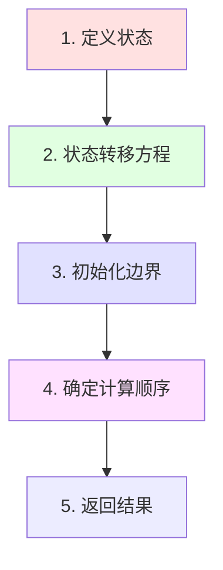

# 动态规划完全指南（Python版）

> ⭐⭐⭐ LeetCode最重要的算法思想

## 核心概念

### 什么是动态规划？

**动态规划（Dynamic Programming, DP）** 是通过把原问题分解为相对简单的子问题的方式来求解复杂问题的方法。

### 三大特征

1. **最优子结构**：问题的最优解包含子问题的最优解
2. **重叠子问题**：递归过程中会重复计算相同的子问题
3. **无后效性**：当前状态只依赖之前的状态，不受之后状态影响

---

## DP解题四步法



### 步骤详解

#### 1. 定义状态
```python
# dp[i] 表示什么？
# dp[i][j] 表示什么？
# 明确每个维度的含义
```

#### 2. 状态转移方程
```python
# dp[i] 如何从 dp[i-1]、dp[i-2]... 推导？
# 找出状态之间的关系
```

#### 3. 初始化边界
```python
# 最简单情况的值
# dp[0] = ?
# dp[0][0] = ?
```

#### 4. 确定计算顺序
```python
# 从前往后还是从后往前？
# 多维DP的遍历顺序
```

---

## Python DP实现方式

### 方式1：记忆化搜索（自顶向下）

```python
from functools import lru_cache

@lru_cache(maxsize=None)  # 自动缓存
def fib(n):
    if n <= 1:
        return n
    return fib(n-1) + fib(n-2)

# 优点：代码简洁，思路清晰
# 缺点：递归深度限制，可能栈溢出
```

### 方式2：迭代DP（自底向上）

```python
def fib(n):
    if n <= 1:
        return n
    dp = [0] * (n + 1)
    dp[0], dp[1] = 0, 1
    for i in range(2, n + 1):
        dp[i] = dp[i-1] + dp[i-2]
    return dp[n]

# 优点：效率高，空间可优化
# 缺点：需要手动填表
```

### 方式3：空间优化

```python
def fib(n):
    if n <= 1:
        return n
    prev, curr = 0, 1
    for _ in range(2, n + 1):
        prev, curr = curr, prev + curr
    return curr

# 优点：O(1)空间
# 适用：只需要前几个状态
```

---

## DP六大经典类型

### 1. 线性DP

#### 1.1 爬楼梯（LeetCode 70）

```python
# 问题：n阶楼梯，每次爬1或2阶，有多少种爬法？

# 定义状态：dp[i] = 爬到第i阶的方法数
# 转移方程：dp[i] = dp[i-1] + dp[i-2]
# 初始化：dp[0] = 1, dp[1] = 1

# 方法1：lru_cache
from functools import lru_cache

@lru_cache(maxsize=None)
def climb_stairs(n):
    if n <= 2:
        return n
    return climb_stairs(n-1) + climb_stairs(n-2)

# 方法2：迭代
def climb_stairs(n):
    if n <= 2:
        return n
    prev, curr = 1, 2
    for _ in range(3, n + 1):
        prev, curr = curr, prev + curr
    return curr
```

#### 1.2 打家劫舍（LeetCode 198）

```python
# 问题：不能抢相邻的房子，求最大金额

# 定义状态：dp[i] = 前i个房子能抢的最大金额
# 转移方程：dp[i] = max(dp[i-1], dp[i-2] + nums[i])
# 初始化：dp[0] = nums[0], dp[1] = max(nums[0], nums[1])

def rob(nums):
    if not nums:
        return 0
    if len(nums) == 1:
        return nums[0]
    
    prev, curr = nums[0], max(nums[0], nums[1])
    for i in range(2, len(nums)):
        prev, curr = curr, max(curr, prev + nums[i])
    
    return curr
```

### 2. 背包DP

#### 2.1 0-1背包

```python
# 问题：n个物品，每个物品只能选0或1次

# 定义状态：dp[i][w] = 前i个物品，容量w时的最大价值
# 转移方程：
#   dp[i][w] = max(
#       dp[i-1][w],                    # 不选第i个
#       dp[i-1][w-weight[i]] + value[i] # 选第i个
#   )

def knapsack_01(weights, values, capacity):
    n = len(weights)
    dp = [[0] * (capacity + 1) for _ in range(n + 1)]
    
    for i in range(1, n + 1):
        for w in range(capacity + 1):
            if weights[i-1] <= w:
                dp[i][w] = max(
                    dp[i-1][w],
                    dp[i-1][w-weights[i-1]] + values[i-1]
                )
            else:
                dp[i][w] = dp[i-1][w]
    
    return dp[n][capacity]

# 空间优化：一维数组
def knapsack_01_optimized(weights, values, capacity):
    dp = [0] * (capacity + 1)
    
    for i in range(len(weights)):
        # 从右往左，避免重复使用
        for w in range(capacity, weights[i] - 1, -1):
            dp[w] = max(dp[w], dp[w-weights[i]] + values[i])
    
    return dp[capacity]
```

#### 2.2 完全背包

```python
# 问题：n个物品，每个物品可以选无限次

# 定义状态：dp[i][w] = 前i个物品，容量w时的最大价值
# 转移方程：
#   dp[i][w] = max(
#       dp[i-1][w],                  # 不选第i个
#       dp[i][w-weight[i]] + value[i] # 选第i个（可重复）
#   )

def knapsack_complete(weights, values, capacity):
    dp = [0] * (capacity + 1)
    
    for i in range(len(weights)):
        # 从左往右，允许重复使用
        for w in range(weights[i], capacity + 1):
            dp[w] = max(dp[w], dp[w-weights[i]] + values[i])
    
    return dp[capacity]

# 零钱兑换（LeetCode 322）
def coin_change(coins, amount):
    dp = [float('inf')] * (amount + 1)
    dp[0] = 0
    
    for coin in coins:
        for x in range(coin, amount + 1):
            dp[x] = min(dp[x], dp[x-coin] + 1)
    
    return dp[amount] if dp[amount] != float('inf') else -1
```

### 3. 区间DP

#### 3.1 最长回文子串（LeetCode 5）

```python
# 定义状态：dp[i][j] = s[i:j+1]是否为回文串
# 转移方程：
#   dp[i][j] = (s[i] == s[j]) and dp[i+1][j-1]
# 初始化：dp[i][i] = True

def longest_palindrome(s):
    n = len(s)
    if n < 2:
        return s
    
    dp = [[False] * n for _ in range(n)]
    max_len = 1
    start = 0
    
    # 初始化：单个字符
    for i in range(n):
        dp[i][i] = True
    
    # 长度从2开始枚举
    for length in range(2, n + 1):
        for i in range(n - length + 1):
            j = i + length - 1
            if s[i] == s[j]:
                if length == 2:
                    dp[i][j] = True
                else:
                    dp[i][j] = dp[i+1][j-1]
            
            if dp[i][j] and length > max_len:
                max_len = length
                start = i
    
    return s[start:start+max_len]

# 中心扩展法（更简洁）
def longest_palindrome_expand(s):
    def expand(left, right):
        while left >= 0 and right < len(s) and s[left] == s[right]:
            left -= 1
            right += 1
        return right - left - 1
    
    start = end = 0
    for i in range(len(s)):
        len1 = expand(i, i)      # 奇数长度
        len2 = expand(i, i + 1)  # 偶数长度
        max_len = max(len1, len2)
        if max_len > end - start:
            start = i - (max_len - 1) // 2
            end = i + max_len // 2
    
    return s[start:end+1]
```

### 4. 双序列DP

#### 4.1 最长公共子序列（LeetCode 1143）

```python
# 定义状态：dp[i][j] = text1前i个字符和text2前j个字符的LCS长度
# 转移方程：
#   if text1[i-1] == text2[j-1]:
#       dp[i][j] = dp[i-1][j-1] + 1
#   else:
#       dp[i][j] = max(dp[i-1][j], dp[i][j-1])

def longest_common_subsequence(text1, text2):
    m, n = len(text1), len(text2)
    dp = [[0] * (n + 1) for _ in range(m + 1)]
    
    for i in range(1, m + 1):
        for j in range(1, n + 1):
            if text1[i-1] == text2[j-1]:
                dp[i][j] = dp[i-1][j-1] + 1
            else:
                dp[i][j] = max(dp[i-1][j], dp[i][j-1])
    
    return dp[m][n]
```

#### 4.2 编辑距离（LeetCode 72）

```python
# 定义状态：dp[i][j] = word1前i个字符转换成word2前j个字符的最少操作数
# 转移方程：
#   if word1[i-1] == word2[j-1]:
#       dp[i][j] = dp[i-1][j-1]
#   else:
#       dp[i][j] = min(
#           dp[i-1][j] + 1,    # 删除
#           dp[i][j-1] + 1,    # 插入
#           dp[i-1][j-1] + 1   # 替换
#       )

def min_distance(word1, word2):
    m, n = len(word1), len(word2)
    dp = [[0] * (n + 1) for _ in range(m + 1)]
    
    # 初始化
    for i in range(m + 1):
        dp[i][0] = i
    for j in range(n + 1):
        dp[0][j] = j
    
    # 状态转移
    for i in range(1, m + 1):
        for j in range(1, n + 1):
            if word1[i-1] == word2[j-1]:
                dp[i][j] = dp[i-1][j-1]
            else:
                dp[i][j] = min(
                    dp[i-1][j],    # 删除
                    dp[i][j-1],    # 插入
                    dp[i-1][j-1]   # 替换
                ) + 1
    
    return dp[m][n]
```

### 5. 树形DP

#### 5.1 打家劫舍III（LeetCode 337）

```python
# 二叉树上的打家劫舍

# 定义状态：对每个节点返回 (不偷该节点的最大值, 偷该节点的最大值)
def rob(root):
    def dfs(node):
        if not node:
            return (0, 0)
        
        left = dfs(node.left)
        right = dfs(node.right)
        
        # 不偷当前节点：左右子树的最大值之和
        not_rob = max(left) + max(right)
        
        # 偷当前节点：当前值 + 左右子树不偷的值
        rob_curr = node.val + left[0] + right[0]
        
        return (not_rob, rob_curr)
    
    return max(dfs(root))
```

### 6. 状态压缩DP

#### 6.1 旅行商问题（TSP）

```python
# 使用位掩码表示已访问城市集合

def tsp(graph):
    n = len(graph)
    # dp[mask][i] = 访问mask表示的城市集合，当前在城市i的最小代价
    dp = [[float('inf')] * n for _ in range(1 << n)]
    dp[1][0] = 0  # 从城市0开始
    
    for mask in range(1 << n):
        for u in range(n):
            if dp[mask][u] == float('inf'):
                continue
            for v in range(n):
                if mask & (1 << v):  # v已访问
                    continue
                new_mask = mask | (1 << v)
                dp[new_mask][v] = min(
                    dp[new_mask][v],
                    dp[mask][u] + graph[u][v]
                )
    
    # 返回终点，访问所有城市
    return min(dp[(1 << n) - 1])
```

---

## DP优化技巧

### 1. 空间优化（滚动数组）

```python
# 原始：二维数组
dp = [[0] * n for _ in range(m)]

# 优化：一维数组（只需要上一行）
dp = [0] * n
prev = [0] * n

for i in range(m):
    for j in range(n):
        # 使用prev[j], dp[j-1]等
        pass
    prev = dp[:]

# 进一步优化：只用两个变量
prev, curr = 0, 0
for i in range(n):
    prev, curr = curr, new_value
```

### 2. 单调队列优化

```python
# 滑动窗口最大值的DP优化
from collections import deque

def max_sliding_window(nums, k):
    dq = deque()
    result = []
    
    for i in range(len(nums)):
        # 移除窗口外元素
        if dq and dq[0] <= i - k:
            dq.popleft()
        
        # 维护单调性
        while dq and nums[dq[-1]] < nums[i]:
            dq.pop()
        
        dq.append(i)
        
        if i >= k - 1:
            result.append(nums[dq[0]])
    
    return result
```

---

## 常见DP模板

### 模板1：一维DP
```python
def dp_1d(n):
    dp = [0] * (n + 1)
    dp[0] = base_value
    
    for i in range(1, n + 1):
        dp[i] = f(dp[i-1], dp[i-2], ...)
    
    return dp[n]
```

### 模板2：二维DP
```python
def dp_2d(m, n):
    dp = [[0] * (n + 1) for _ in range(m + 1)]
    
    # 初始化
    for i in range(m + 1):
        dp[i][0] = init_value
    for j in range(n + 1):
        dp[0][j] = init_value
    
    # 状态转移
    for i in range(1, m + 1):
        for j in range(1, n + 1):
            dp[i][j] = f(dp[i-1][j], dp[i][j-1], ...)
    
    return dp[m][n]
```

### 模板3：记忆化搜索
```python
from functools import lru_cache

@lru_cache(maxsize=None)
def dp_memo(state):
    if base_case:
        return base_value
    
    result = init
    for choice in choices:
        result = opt(result, dp_memo(new_state))
    
    return result
```

---

## 学习建议

### 入门题目（必刷）
1. ⭐ 爬楼梯（70）
2. ⭐ 打家劫舍（198）
3. ⭐ 最大子数组和（53）
4. ⭐ 零钱兑换（322）
5. ⭐ 最长递增子序列（300）

### 进阶题目
6. ⭐⭐ 分割等和子集（416）
7. ⭐⭐ 最长回文子串（5）
8. ⭐⭐ 最长公共子序列（1143）
9. ⭐⭐ 编辑距离（72）
10. ⭐⭐ 不同路径（62）

### 困难题目
11. ⭐⭐⭐ 戳气球（312）
12. ⭐⭐⭐ 正则表达式匹配（10）
13. ⭐⭐⭐ 通配符匹配（44）

---

## Python DP技巧总结

### 1. 使用lru_cache
```python
from functools import lru_cache

@lru_cache(maxsize=None)
def dp(n):
    # 自动缓存，避免重复计算
    pass
```

### 2. 列表推导式初始化
```python
# 一维
dp = [0] * n
dp = [float('inf')] * n

# 二维
dp = [[0] * n for _ in range(m)]
```

### 3. 使用float('inf')
```python
# 求最小值时的初始化
dp = [float('inf')] * n
dp[0] = 0

# 判断是否可达
if dp[n] != float('inf'):
    return dp[n]
```

### 4. 空间优化
```python
# 只需要前一个状态
prev, curr = init_value1, init_value2
for i in range(n):
    prev, curr = curr, new_value
```

---

**下一步**：
1. 刷完10道经典DP题
2. 总结状态转移方程模式
3. 查看 → `templates/动态规划模板.md`
