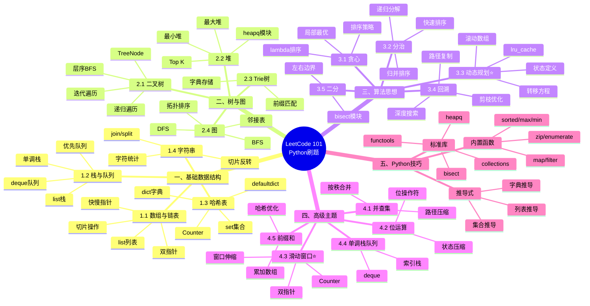
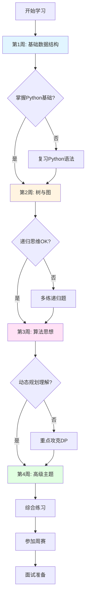
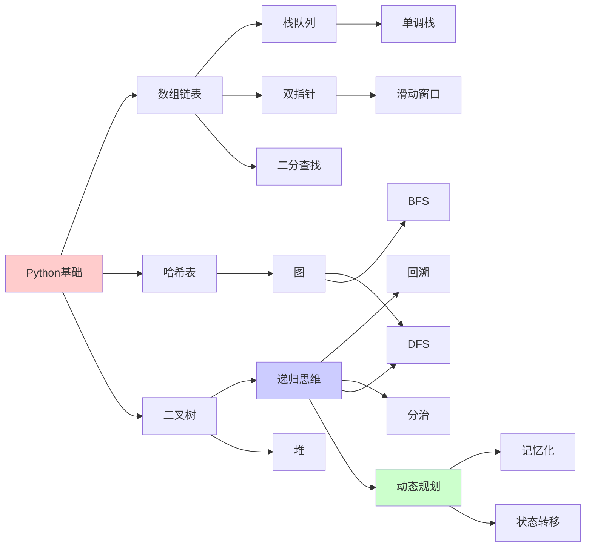

# LeetCode 101 整体知识架构 - 思维导图

> 🎯 全局视角掌握算法知识体系

## 核心知识架构



---

## 四大核心板块

### 📦 板块一：基础数据结构（第1周）

**重要程度**：⭐⭐⭐⭐⭐  
**学习时间**：7-10天  
**核心文件**：`mindmaps/01-基础数据结构脑图.md`

#### 知识点清单
- ✅ 数组与链表 → `knowledge/01-数组与链表.md`
- ✅ 栈与队列 → `knowledge/02-栈与队列.md`
- ✅ 哈希表 → `knowledge/03-哈希表.md`
- ✅ 字符串 → `knowledge/04-字符串.md`

#### Python重点
```python
# list → 数组、栈
arr = [1, 2, 3]
stack = []

# dict → 哈希表
hash_map = {}
from collections import defaultdict

# set → 哈希集合  
hash_set = set()

# deque → 队列
from collections import deque
queue = deque()
```

#### 关联题目
- 两数之和 (哈希表)
- 反转链表 (链表)
- 有效的括号 (栈)
- 滑动窗口最大值 (队列)

---

### 🌲 板块二：树与图结构（第2周）

**重要程度**：⭐⭐⭐⭐⭐  
**学习时间**：7-10天  
**核心文件**：`mindmaps/02-树与图结构脑图.md`

#### 知识点清单
- ✅ 二叉树 → `knowledge/05-二叉树.md`
- ✅ 堆 → `knowledge/06-堆.md`
- ✅ 前缀树 → `knowledge/07-前缀树Trie.md`
- ✅ 图论 → `knowledge/08-图论基础.md`

#### Python重点
```python
# TreeNode → 二叉树
class TreeNode:
    def __init__(self, val=0, left=None, right=None):
        self.val = val
        self.left = left
        self.right = right

# heapq → 堆
import heapq
heap = []
heapq.heappush(heap, val)

# dict → Trie
class TrieNode:
    def __init__(self):
        self.children = {}
        self.is_end = False

# dict/list → 图的邻接表
graph = defaultdict(list)
```

#### 关联题目
- 二叉树的层序遍历 (BFS)
- 二叉树的最近公共祖先 (递归)
- 数据流的中位数 (双堆)
- 岛屿数量 (DFS/BFS)

---

### 🧠 板块三：算法思想（第3周）

**重要程度**：⭐⭐⭐⭐⭐  
**学习时间**：10-14天  
**核心文件**：`mindmaps/03-算法思想脑图.md`

#### 知识点清单
- ✅ 贪心 → `knowledge/09-贪心算法.md`
- ✅ 分治 → `knowledge/10-分治算法.md`
- ⭐ 动态规划 → `knowledge/11-动态规划.md` (重点)
- ✅ 回溯 → `knowledge/12-回溯算法.md`
- ✅ 二分 → `knowledge/13-二分查找.md`

#### Python重点
```python
# 动态规划 - lru_cache
from functools import lru_cache

@lru_cache(maxsize=None)
def dp(n):
    if n <= 1:
        return n
    return dp(n-1) + dp(n-2)

# 回溯 - 深拷贝
path.append(choice)
backtrack(path[:])  # 复制
path.pop()

# 二分 - bisect
import bisect
pos = bisect.bisect_left(arr, target)
```

#### 关联题目
- 跳跃游戏 (贪心)
- 归并排序 (分治)
- 爬楼梯 (DP)
- 全排列 (回溯)
- 搜索旋转数组 (二分)

---

### 🚀 板块四：高级主题（第4周）

**重要程度**：⭐⭐⭐⭐  
**学习时间**：7-10天  
**核心文件**：`mindmaps/04-高级主题脑图.md`

#### 知识点清单
- ✅ 并查集 → `data-structures/并查集实现.md`
- ✅ 位运算 → `algorithms/位运算技巧.md`
- ⭐ 滑动窗口 → `algorithms/滑动窗口技巧.md` (高频)
- ✅ 单调栈队列 → `algorithms/单调栈队列.md`
- ✅ 前缀和 → `algorithms/前缀和与差分.md`

#### Python重点
```python
# 滑动窗口
from collections import Counter
need = Counter(t)
window = {}

# 单调栈
stack = []  # 存索引
while stack and nums[stack[-1]] < nums[i]:
    stack.pop()

# 前缀和
prefix = [0]
for num in nums:
    prefix.append(prefix[-1] + num)
```

#### 关联题目
- 最小覆盖子串 (滑动窗口)
- 每日温度 (单调栈)
- 子数组和为K (前缀和+哈希)

---

## 学习路径图



---

## 难度分级

### ⭐ 基础必会（Simple）
- 数组、链表基本操作
- 栈、队列使用
- 哈希表应用
- 树的遍历
- 简单DFS/BFS

**推荐刷题量**：50-80题  
**时间投入**：第1-2周

---

### ⭐⭐ 进阶掌握（Medium）
- 双指针技巧
- 滑动窗口
- 二分查找变体
- 简单DP
- 回溯框架

**推荐刷题量**：80-120题  
**时间投入**：第2-3周

---

### ⭐⭐⭐ 核心精通（Medium-Hard）
- 动态规划各类型
- 复杂回溯问题
- 图的高级算法
- 单调栈队列
- 前缀和优化

**推荐刷题量**：100+题  
**时间投入**：第3-4周及以后

---

### ⭐⭐⭐⭐ 竞赛拓展（Hard）
- 困难DP
- 高级数据结构
- 数学技巧
- 状态压缩
- 复杂优化

**推荐刷题量**：视个人需求  
**时间投入**：长期积累

---

## 知识点依赖关系



---

## 时间复杂度参考

| 复杂度 | 数量级 | 算法示例 | Python实现 |
|--------|--------|---------|-----------|
| O(1) | 常数 | 哈希查找 | `dict[key]` |
| O(logn) | 对数 | 二分查找 | `bisect` |
| O(n) | 线性 | 遍历数组 | `for x in arr` |
| O(nlogn) | 线性对数 | 排序 | `sorted()` |
| O(n²) | 平方 | 双重循环 | 嵌套for |
| O(2ⁿ) | 指数 | 暴力回溯 | 全排列 |
| O(n!) | 阶乘 | 全排列 | permutations |

---

## 重点标记说明

- ⭐ = 基础必会
- ⭐⭐ = 重要掌握
- ⭐⭐⭐ = 核心精通
- ⭐⭐⭐⭐ = 竞赛拓展
- 🔥 = 高频考点
- 💡 = Python特色

---

## 下一步

1. **理解整体架构** ✅ (当前)
2. **查看详细脑图** → `01-基础数据结构脑图.md`
3. **开始学习计划** → `practice/学习计划-第1周.md`
4. **刷题实践** → `practice/必刷题目清单.md`

---

**建议**：将本思维导图打印或保存，随时查阅，建立全局观！
