# 基础数据结构 - 思维导图

> 📚 Python实现的基础数据结构全景图

## 核心数据结构脑图

```mermaid
graph TB
    Root["基础数据结构"]
    
    A1["1. 数组与链表"]
    A11["Python list"]
    A111["动态数组"]
    A112["随机访问O1"]
    A113["append/pop"]
    A114["切片操作"]
    
    A12["Python操作"]
    A121["索引访问"]
    A122["反转"]
    A123["切片"]
    A124["排序"]
    
    A13["双指针技巧"]
    A131["对撞指针"]
    A132["快慢指针"]
    A133["滑动窗口"]
    
    A14["链表ListNode"]
    A141["单链表"]
    A142["双向链表"]
    A143["虚拟头节点"]
    A144["递归操作"]
    
    B1["2. 栈与队列"]
    B11["栈Stack"]
    B111["list实现"]
    B112["append入栈"]
    B113["pop出栈"]
    B114["栈顶访问"]
    
    B12["队列Queue"]
    B121["deque双端队列"]
    B122["append入队"]
    B123["popleft出队"]
    B124["collections"]
    
    B13["单调栈"]
    B131["维护单调性"]
    B132["下一个更大"]
    B133["存储索引"]
    
    B14["优先队列"]
    B141["heapq模块"]
    B142["heappush"]
    B143["heappop"]
    B144["最小堆"]
    
    C1["3. 哈希表"]
    C11["字典dict"]
    C111["key-value"]
    C112["O1查找"]
    C113["get方法"]
    
    C12["defaultdict"]
    C121["默认值"]
    C122["避免KeyError"]
    C123["分组统计"]
    
    C13["Counter"]
    C131["计数器"]
    C132["most_common"]
    C133["频率统计"]
    
    C14["集合set"]
    C141["去重"]
    C142["交并差"]
    C143["成员测试O1"]
    
    D1["4. 字符串"]
    D11["不可变性"]
    D111["创建新串"]
    D112["list转换"]
    D113["join拼接"]
    
    D12["常用操作"]
    D121["split"]
    D122["strip"]
    D123["replace"]
    D124["upper/lower"]
    
    D13["切片技巧"]
    D131["反转"]
    D132["间隔"]
    D133["子串"]
    
    D14["Python特性"]
    D141["f-string"]
    D142["字符串乘法"]
    D143["in运算符"]
    
    Root --> A1
    Root --> B1
    Root --> C1
    Root --> D1
    
    A1 --> A11
    A1 --> A12
    A1 --> A13
    A1 --> A14
    
    A11 --> A111
    A11 --> A112
    A11 --> A113
    A11 --> A114
    
    A12 --> A121
    A12 --> A122
    A12 --> A123
    A12 --> A124
    
    A13 --> A131
    A13 --> A132
    A13 --> A133
    
    A14 --> A141
    A14 --> A142
    A14 --> A143
    A14 --> A144
    
    B1 --> B11
    B1 --> B12
    B1 --> B13
    B1 --> B14
    
    B11 --> B111
    B11 --> B112
    B11 --> B113
    B11 --> B114
    
    B12 --> B121
    B12 --> B122
    B12 --> B123
    B12 --> B124
    
    B13 --> B131
    B13 --> B132
    B13 --> B133
    
    B14 --> B141
    B14 --> B142
    B14 --> B143
    B14 --> B144
    
    C1 --> C11
    C1 --> C12
    C1 --> C13
    C1 --> C14
    
    C11 --> C111
    C11 --> C112
    C11 --> C113
    
    C12 --> C121
    C12 --> C122
    C12 --> C123
    
    C13 --> C131
    C13 --> C132
    C13 --> C133
    
    C14 --> C141
    C14 --> C142
    C14 --> C143
    
    D1 --> D11
    D1 --> D12
    D1 --> D13
    D1 --> D14
    
    D11 --> D111
    D11 --> D112
    D11 --> D113
    
    D12 --> D121
    D12 --> D122
    D12 --> D123
    D12 --> D124
    
    D13 --> D131
    D13 --> D132
    D13 --> D133
    
    D14 --> D141
    D14 --> D142
    D14 --> D143
```



---

## 1. 数组与链表详解

### 1.1 Python List（数组）

#### 核心特性
```python
# 动态数组
arr = []                    # 创建
arr = [1, 2, 3]            # 初始化
arr = [0] * n              # 固定大小

# 访问 O(1)
val = arr[0]               # 首元素
val = arr[-1]              # 末元素

# 修改 O(1)
arr[0] = 10

# 插入 
arr.append(4)              # 末尾 O(1)
arr.insert(0, 0)           # 指定位置 O(n)

# 删除
arr.pop()                  # 末尾 O(1)
arr.pop(0)                 # 指定位置 O(n)
arr.remove(val)            # 删除值 O(n)

# 切片 O(k)
sub = arr[1:3]            # [start:end)
reversed_arr = arr[::-1]   # 反转
```

#### 高级操作
```python
# 列表推导式
squares = [x**2 for x in range(10)]
evens = [x for x in nums if x % 2 == 0]

# 排序
arr.sort()                 # 原地排序
sorted_arr = sorted(arr)   # 返回新列表
arr.sort(key=lambda x: x[1])  # 自定义排序

# 查找
idx = arr.index(val)       # 查找索引
count = arr.count(val)     # 统计次数

# 多维数组
matrix = [[0] * n for _ in range(m)]  # m×n矩阵
```

### 1.2 链表实现

#### 单链表节点
```python
class ListNode:
    def __init__(self, val=0, next=None):
        self.val = val
        self.next = next

# 创建链表
head = ListNode(1)
head.next = ListNode(2)
head.next.next = ListNode(3)

# 遍历
curr = head
while curr:
    print(curr.val)
    curr = curr.next

# 插入节点
new_node = ListNode(4)
new_node.next = head
head = new_node

# 删除节点（需要前驱节点）
prev.next = prev.next.next
```

#### 虚拟头节点技巧
```python
def remove_elements(head, val):
    dummy = ListNode(0)  # 虚拟头
    dummy.next = head
    curr = dummy
    
    while curr.next:
        if curr.next.val == val:
            curr.next = curr.next.next
        else:
            curr = curr.next
    
    return dummy.next
```

### 1.3 双指针技巧

#### 对撞指针
```python
def two_sum_sorted(nums, target):
    left, right = 0, len(nums) - 1
    while left < right:
        curr_sum = nums[left] + nums[right]
        if curr_sum == target:
            return [left, right]
        elif curr_sum < target:
            left += 1
        else:
            right -= 1
    return [-1, -1]
```

#### 快慢指针
```python
# 找链表中点
def find_middle(head):
    slow = fast = head
    while fast and fast.next:
        slow = slow.next
        fast = fast.next.next
    return slow

# 检测环
def has_cycle(head):
    slow = fast = head
    while fast and fast.next:
        slow = slow.next
        fast = fast.next.next
        if slow == fast:
            return True
    return False
```

---

## 2. 栈与队列详解

### 2.1 栈（Stack）

#### List实现栈
```python
# 初始化
stack = []

# 入栈 O(1)
stack.append(1)
stack.append(2)

# 出栈 O(1)
top = stack.pop()

# 查看栈顶
if stack:
    top = stack[-1]

# 判空
if not stack:
    print("空栈")
```

#### 经典应用：括号匹配
```python
def is_valid(s):
    stack = []
    pairs = {'(': ')', '[': ']', '{': '}'}
    
    for char in s:
        if char in pairs:
            stack.append(char)
        elif not stack or pairs[stack.pop()] != char:
            return False
    
    return not stack
```

### 2.2 队列（Queue）

#### Deque实现队列
```python
from collections import deque

# 初始化
queue = deque()

# 入队 O(1)
queue.append(1)
queue.append(2)

# 出队 O(1)
front = queue.popleft()

# 查看队首
if queue:
    front = queue[0]

# 双端操作
queue.appendleft(0)    # 左端入队
queue.pop()            # 右端出队
```

### 2.3 单调栈

```python
# 下一个更大元素
def next_greater_element(nums):
    stack = []
    result = [-1] * len(nums)
    
    for i in range(len(nums)):
        # 维护单调递减栈
        while stack and nums[stack[-1]] < nums[i]:
            result[stack.pop()] = nums[i]
        stack.append(i)
    
    return result
```

### 2.4 优先队列（堆）

```python
import heapq

# 最小堆
min_heap = []
heapq.heappush(min_heap, 3)
heapq.heappush(min_heap, 1)
min_val = heapq.heappop(min_heap)  # 1

# 最大堆（元素取负）
max_heap = []
heapq.heappush(max_heap, -3)
max_val = -heapq.heappop(max_heap)  # 3

# Top K 问题
k_largest = heapq.nlargest(k, nums)
k_smallest = heapq.nsmallest(k, nums)
```

---

## 3. 哈希表详解

### 3.1 字典（Dict）

```python
# 创建
hash_map = {}
hash_map = {'key': 'value'}

# 插入/更新 O(1)
hash_map['name'] = 'Alice'

# 查找 O(1)
val = hash_map.get('name', default_value)
if 'name' in hash_map:
    val = hash_map['name']

# 删除
del hash_map['name']
hash_map.pop('name', None)

# 遍历
for key in hash_map:
    print(key, hash_map[key])

for key, value in hash_map.items():
    print(key, value)

# 字典推导式
{k: v for k, v in items if condition}
```

### 3.2 DefaultDict

```python
from collections import defaultdict

# 默认int
count = defaultdict(int)
for num in nums:
    count[num] += 1  # 不用检查键是否存在

# 默认list
graph = defaultdict(list)
graph[1].append(2)  # 自动创建空列表

# 默认set
groups = defaultdict(set)
groups[key].add(value)
```

### 3.3 Counter

```python
from collections import Counter

# 统计频率
nums = [1, 1, 2, 3, 3, 3]
counter = Counter(nums)
# Counter({3: 3, 1: 2, 2: 1})

# 最常见元素
most_common = counter.most_common(2)
# [(3, 3), (1, 2)]

# 字符串统计
s = "hello"
char_count = Counter(s)
# Counter({'l': 2, 'h': 1, 'e': 1, 'o': 1})

# 运算
c1 + c2      # 相加
c1 - c2      # 相减
c1 & c2      # 交集
c1 | c2      # 并集
```

### 3.4 集合（Set）

```python
# 创建
s = set()
s = {1, 2, 3}
s = set([1, 2, 3])

# 添加 O(1)
s.add(4)

# 删除 O(1)
s.remove(1)    # 不存在会报错
s.discard(1)   # 不存在不报错

# 成员测试 O(1)
if 1 in s:
    pass

# 集合运算
s1 & s2        # 交集
s1 | s2        # 并集
s1 - s2        # 差集
s1 ^ s2        # 对称差

# 集合推导式
{x for x in nums if x > 0}
```

---

## 4. 字符串详解

### 4.1 基本操作

```python
s = "hello world"

# 访问
char = s[0]      # 'h'
char = s[-1]     # 'd'

# 切片
sub = s[0:5]     # "hello"
sub = s[::-1]    # "dlrow olleh"  反转
sub = s[::2]     # "hlowrd"  间隔

# 拼接
s1 + s2
' '.join(list)   # 推荐方式

# 分割
words = s.split()          # 按空格
parts = s.split(',')       # 按逗号

# 查找
idx = s.find('world')      # 返回索引或-1
idx = s.index('world')     # 返回索引或报错
count = s.count('l')       # 统计次数

# 替换
new_s = s.replace('world', 'python')

# 大小写
s.upper()
s.lower()
s.capitalize()
s.title()

# 判断
s.isdigit()
s.isalpha()
s.isalnum()
s.startswith('hello')
s.endswith('world')
```

### 4.2 Python特性

```python
# f-string
name = "Alice"
age = 20
msg = f"{name} is {age} years old"

# 字符串乘法
s = "ab" * 3  # "ababab"

# in 运算符
if "hello" in text:
    pass

# 字符串格式化
"{} {}".format(a, b)
"{0} {1}".format(a, b)
"{name} {age}".format(name="Alice", age=20)
```

### 4.3 字符串算法

```python
# 回文判断
def is_palindrome(s):
    return s == s[::-1]

# 双指针回文
def is_palindrome_two_pointer(s):
    left, right = 0, len(s) - 1
    while left < right:
        if s[left] != s[right]:
            return False
        left += 1
        right -= 1
    return True

# 字符频率统计
from collections import Counter
def char_frequency(s):
    return Counter(s)

# KMP匹配（简化版）
def str_str(haystack, needle):
    if not needle:
        return 0
    return haystack.find(needle)
```

---

## 时间复杂度对比

| 操作 | List | Deque | Dict | Set |
|------|------|-------|------|-----|
| 访问 | O(1) | O(1) | - | - |
| 查找 | O(n) | O(n) | O(1) | O(1) |
| 插入（末尾） | O(1) | O(1) | O(1) | O(1) |
| 插入（开头） | O(n) | O(1) | - | - |
| 删除（末尾） | O(1) | O(1) | O(1) | O(1) |
| 删除（开头） | O(n) | O(1) | - | - |

---

## Python常用内置函数

```python
# 序列操作
len(arr)              # 长度
max(arr)              # 最大值
min(arr)              # 最小值
sum(arr)              # 求和
sorted(arr)           # 排序
reversed(arr)         # 反转

# 迭代器
enumerate(arr)        # 索引和值
zip(a, b)            # 并行迭代
map(func, arr)       # 映射
filter(func, arr)    # 过滤

# 逻辑判断
any([True, False])   # 任一True
all([True, True])    # 全部True
```

---

## 下一步学习

1. **动手实践** → `data-structures/链表实现.md`
2. **刷题练习** → `practice/学习计划-第1周.md`
3. **查看算法** → `algorithms/双指针技巧.md`
