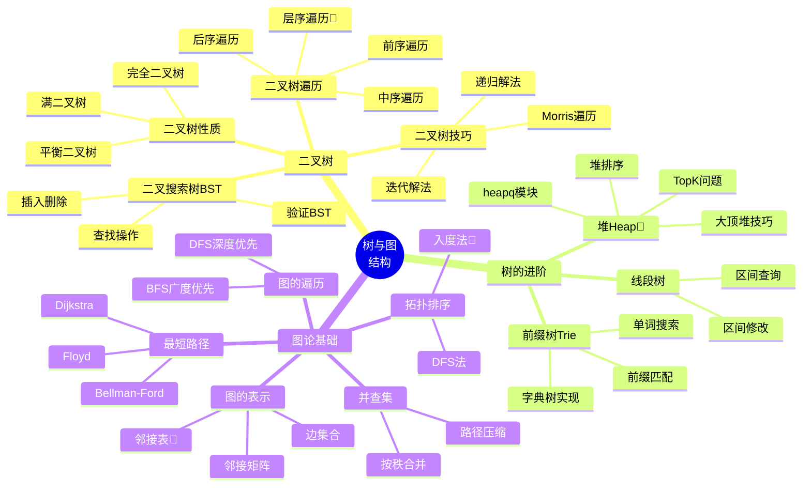

# 🌲 树与图结构脑图

> 🐍 Python专属 | 树与图是算法面试的核心，掌握这部分内容能解决40%的算法题

---

## 📊 整体架构思维导图



---

## 🌳 一、二叉树核心

### 1.1 二叉树遍历（必须掌握）

#### 📌 前序遍历（根→左→右）

```python
# 递归写法 - 最简洁
def preorder_recursive(root):
    result = []
    def dfs(node):
        if not node:
            return
        result.append(node.val)    # 根
        dfs(node.left)             # 左
        dfs(node.right)            # 右
    dfs(root)
    return result

# 迭代写法 - 用栈模拟🐍
def preorder_iterative(root):
    if not root:
        return []
    result = []
    stack = [root]
    while stack:
        node = stack.pop()
        result.append(node.val)
        # 先压右子树，后压左子树（栈是后进先出）
        if node.right:
            stack.append(node.right)
        if node.left:
            stack.append(node.left)
    return result
```

#### 📌 中序遍历（左→根→右）- BST有序

```python
# 递归写法
def inorder_recursive(root):
    result = []
    def dfs(node):
        if not node:
            return
        dfs(node.left)             # 左
        result.append(node.val)    # 根
        dfs(node.right)            # 右
    dfs(root)
    return result

# 迭代写法🐍
def inorder_iterative(root):
    result = []
    stack = []
    curr = root
    while curr or stack:
        # 一直往左走，把路径压栈
        while curr:
            stack.append(curr)
            curr = curr.left
        # 弹出节点，访问值
        curr = stack.pop()
        result.append(curr.val)
        # 转向右子树
        curr = curr.right
    return result
```

#### 📌 后序遍历（左→右→根）

```python
# 递归写法
def postorder_recursive(root):
    result = []
    def dfs(node):
        if not node:
            return
        dfs(node.left)             # 左
        dfs(node.right)            # 右
        result.append(node.val)    # 根
    dfs(root)
    return result

# 迭代写法（前序变形）🐍
def postorder_iterative(root):
    if not root:
        return []
    result = []
    stack = [root]
    while stack:
        node = stack.pop()
        result.append(node.val)
        # 先左后右（与前序相反）
        if node.left:
            stack.append(node.left)
        if node.right:
            stack.append(node.right)
    return result[::-1]  # 反转得到后序
```

#### 📌 层序遍历（BFS）🐍

```python
from collections import deque

def level_order(root):
    if not root:
        return []
    result = []
    queue = deque([root])
    
    while queue:
        level_size = len(queue)  # 当前层的节点数
        level = []
        for _ in range(level_size):
            node = queue.popleft()
            level.append(node.val)
            if node.left:
                queue.append(node.left)
            if node.right:
                queue.append(node.right)
        result.append(level)
    return result
```

### 1.2 二叉树常见技巧

#### 📌 树的深度和高度

```python
# 最大深度（DFS）
def max_depth(root):
    if not root:
        return 0
    return 1 + max(max_depth(root.left), max_depth(root.right))

# 最小深度（BFS更优）🐍
def min_depth(root):
    if not root:
        return 0
    queue = deque([(root, 1)])
    while queue:
        node, depth = queue.popleft()
        if not node.left and not node.right:  # 叶子节点
            return depth
        if node.left:
            queue.append((node.left, depth + 1))
        if node.right:
            queue.append((node.right, depth + 1))
```

#### 📌 翻转二叉树

```python
def invert_tree(root):
    if not root:
        return None
    # 交换左右子树
    root.left, root.right = root.right, root.left
    invert_tree(root.left)
    invert_tree(root.right)
    return root
```

#### 📌 对称二叉树

```python
def is_symmetric(root):
    def is_mirror(left, right):
        if not left and not right:
            return True
        if not left or not right:
            return False
        return (left.val == right.val and 
                is_mirror(left.left, right.right) and
                is_mirror(left.right, right.left))
    return is_mirror(root, root)
```

### 1.3 二叉搜索树 BST

#### 📌 验证BST

```python
def is_valid_bst(root):
    def validate(node, min_val, max_val):
        if not node:
            return True
        if not (min_val < node.val < max_val):
            return False
        return (validate(node.left, min_val, node.val) and
                validate(node.right, node.val, max_val))
    
    return validate(root, float('-inf'), float('inf'))
```

#### 📌 BST插入和删除

```python
# 插入节点
def insert_into_bst(root, val):
    if not root:
        return TreeNode(val)
    if val < root.val:
        root.left = insert_into_bst(root.left, val)
    else:
        root.right = insert_into_bst(root.right, val)
    return root

# 删除节点
def delete_node(root, key):
    if not root:
        return None
    if key < root.val:
        root.left = delete_node(root.left, key)
    elif key > root.val:
        root.right = delete_node(root.right, key)
    else:
        # 找到要删除的节点
        if not root.left:
            return root.right
        if not root.right:
            return root.left
        # 找右子树最小节点替换
        min_node = root.right
        while min_node.left:
            min_node = min_node.left
        root.val = min_node.val
        root.right = delete_node(root.right, min_node.val)
    return root
```

---

## 📚 二、堆 Heap（Python heapq）

### 2.1 Python heapq 模块🐍

```python
import heapq

# 小顶堆（Python默认）
heap = []
heapq.heappush(heap, 3)
heapq.heappush(heap, 1)
heapq.heappush(heap, 4)
print(heap[0])  # 1 - 堆顶最小

# 弹出最小元素
min_val = heapq.heappop(heap)

# 批量建堆
nums = [3, 1, 4, 1, 5, 9]
heapq.heapify(nums)

# 获取最大/最小的N个元素
largest_3 = heapq.nlargest(3, nums)
smallest_3 = heapq.nsmallest(3, nums)
```

### 2.2 大顶堆技巧🐍

```python
# Python没有大顶堆，用负数模拟
import heapq

max_heap = []
heapq.heappush(max_heap, -3)
heapq.heappush(max_heap, -1)
heapq.heappush(max_heap, -4)

# 弹出最大值（负数的最小值）
max_val = -heapq.heappop(max_heap)  # 4
```

### 2.3 TopK 问题🔥

```python
# 第K大的元素
def find_kth_largest(nums, k):
    # 方法1: 用小顶堆维护K个最大元素🐍
    heap = nums[:k]
    heapq.heapify(heap)
    for num in nums[k:]:
        if num > heap[0]:
            heapq.heapreplace(heap, num)
    return heap[0]

# 方法2: 快速选择（更快）
def find_kth_largest_quick(nums, k):
    import random
    def partition(left, right):
        pivot_idx = random.randint(left, right)
        nums[pivot_idx], nums[right] = nums[right], nums[pivot_idx]
        pivot = nums[right]
        i = left
        for j in range(left, right):
            if nums[j] >= pivot:
                nums[i], nums[j] = nums[j], nums[i]
                i += 1
        nums[i], nums[right] = nums[right], nums[i]
        return i
    
    left, right = 0, len(nums) - 1
    while True:
        pos = partition(left, right)
        if pos == k - 1:
            return nums[pos]
        elif pos < k - 1:
            left = pos + 1
        else:
            right = pos - 1
```

---

## 🔍 三、前缀树 Trie

### 3.1 Trie 实现🐍

```python
class TrieNode:
    def __init__(self):
        self.children = {}  # 用字典存储子节点🐍
        self.is_end = False

class Trie:
    def __init__(self):
        self.root = TrieNode()
    
    def insert(self, word):
        node = self.root
        for char in word:
            if char not in node.children:
                node.children[char] = TrieNode()
            node = node.children[char]
        node.is_end = True
    
    def search(self, word):
        node = self.root
        for char in word:
            if char not in node.children:
                return False
            node = node.children[char]
        return node.is_end
    
    def starts_with(self, prefix):
        node = self.root
        for char in prefix:
            if char not in node.children:
                return False
            node = node.children[char]
        return True
```

---

## 🗺️ 四、图论基础

### 4.1 图的表示🐍

```python
# 邻接表（Python字典+列表）🐍
graph = {
    0: [1, 2],
    1: [0, 3, 4],
    2: [0, 4],
    3: [1],
    4: [1, 2]
}

# 邻接矩阵
n = 5
graph_matrix = [[0] * n for _ in range(n)]
graph_matrix[0][1] = 1  # 边 0 -> 1
graph_matrix[1][0] = 1  # 无向图要双向

# 边集合（适合Kruskal）
edges = [(0, 1, 2), (1, 2, 3), (0, 2, 1)]  # (u, v, weight)
```

### 4.2 图的遍历

#### 📌 DFS 深度优先

```python
def dfs(graph, start):
    visited = set()
    result = []
    
    def dfs_helper(node):
        visited.add(node)
        result.append(node)
        for neighbor in graph[node]:
            if neighbor not in visited:
                dfs_helper(neighbor)
    
    dfs_helper(start)
    return result
```

#### 📌 BFS 广度优先🐍

```python
from collections import deque

def bfs(graph, start):
    visited = {start}
    queue = deque([start])
    result = []
    
    while queue:
        node = queue.popleft()
        result.append(node)
        for neighbor in graph[node]:
            if neighbor not in visited:
                visited.add(neighbor)
                queue.append(neighbor)
    return result
```

### 4.3 拓扑排序🐍

```python
from collections import deque, defaultdict

def topological_sort(n, edges):
    # 构建图和入度表
    graph = defaultdict(list)
    in_degree = [0] * n
    
    for u, v in edges:
        graph[u].append(v)
        in_degree[v] += 1
    
    # 入度为0的节点入队
    queue = deque([i for i in range(n) if in_degree[i] == 0])
    result = []
    
    while queue:
        node = queue.popleft()
        result.append(node)
        for neighbor in graph[node]:
            in_degree[neighbor] -= 1
            if in_degree[neighbor] == 0:
                queue.append(neighbor)
    
    # 如果result长度不等于n，说明有环
    return result if len(result) == n else []
```

### 4.4 并查集🔥

```python
class UnionFind:
    def __init__(self, n):
        self.parent = list(range(n))
        self.rank = [0] * n
    
    def find(self, x):
        # 路径压缩
        if self.parent[x] != x:
            self.parent[x] = self.find(self.parent[x])
        return self.parent[x]
    
    def union(self, x, y):
        root_x = self.find(x)
        root_y = self.find(y)
        
        if root_x == root_y:
            return False
        
        # 按秩合并
        if self.rank[root_x] < self.rank[root_y]:
            self.parent[root_x] = root_y
        elif self.rank[root_x] > self.rank[root_y]:
            self.parent[root_y] = root_x
        else:
            self.parent[root_y] = root_x
            self.rank[root_x] += 1
        return True
    
    def connected(self, x, y):
        return self.find(x) == self.find(y)
```

---

## 🎯 五、经典题目汇总

### 🌳 二叉树经典题（必做）

| 题号 | 题目 | 难度 | 核心技巧 |
|------|------|------|---------|
| 94 | 二叉树的中序遍历 | ⭐ | 递归/迭代🐍 |
| 102 | 二叉树的层序遍历 | ⭐⭐ | BFS + deque🐍 |
| 104 | 二叉树的最大深度 | ⭐ | 递归 |
| 226 | 翻转二叉树 | ⭐ | 递归交换 |
| 101 | 对称二叉树 | ⭐ | 镜像递归 |
| 98 | 验证二叉搜索树 | ⭐⭐ | 中序遍历有序 |
| 236 | 二叉树的最近公共祖先 | ⭐⭐ | 递归 |
| 543 | 二叉树的直径 | ⭐ | DFS求深度 |

### 📚 堆经典题（必做）

| 题号 | 题目 | 难度 | 核心技巧 |
|------|------|------|---------|
| 215 | 数组中的第K个最大元素 | ⭐⭐ | heapq小顶堆🐍 |
| 347 | 前K个高频元素 | ⭐⭐ | Counter + heapq🐍 |
| 295 | 数据流的中位数 | ⭐⭐⭐ | 大小堆配合 |
| 23 | 合并K个升序链表 | ⭐⭐⭐ | heapq🐍 |

### 🗺️ 图论经典题（必做）

| 题号 | 题目 | 难度 | 核心技巧 |
|------|------|------|---------|
| 200 | 岛屿数量 | ⭐⭐ | DFS/BFS |
| 207 | 课程表 | ⭐⭐ | 拓扑排序🐍 |
| 210 | 课程表II | ⭐⭐ | 拓扑排序 |
| 547 | 省份数量 | ⭐⭐ | 并查集🔥 |
| 684 | 冗余连接 | ⭐⭐ | 并查集 |

---

## 📝 学习建议

### 🎯 学习顺序
1. **第1周**: 掌握二叉树四种遍历（递归+迭代）
2. **第2周**: 练习BST和二叉树技巧题
3. **第3周**: 学习堆和Trie
4. **第4周**: 掌握图的DFS/BFS/拓扑排序/并查集

### 🔥 重点掌握
- ✅ 层序遍历（BFS + deque）🐍
- ✅ Python heapq 模块的使用
- ✅ 并查集的路径压缩
- ✅ 拓扑排序的入度法

### 🐍 Python特色技巧
```python
# 1. deque 双端队列（比list快）
from collections import deque
queue = deque([1, 2, 3])
queue.append(4)      # 右端入队
queue.popleft()      # 左端出队

# 2. heapq 堆操作
import heapq
heap = [3, 1, 4]
heapq.heapify(heap)  # 原地建堆

# 3. defaultdict 简化图的构建
from collections import defaultdict
graph = defaultdict(list)
graph[0].append(1)   # 自动创建空列表

# 4. 负数模拟大顶堆
max_heap = [-x for x in nums]
heapq.heapify(max_heap)
```

---

## 🔗 相关文件链接

- 📖 [树与图知识点详解](../knowledge/02-二叉树基础.md)
- 📖 [堆与优先队列](../knowledge/05-堆与优先队列.md)
- 📖 [图论算法](../knowledge/07-图论基础.md)
- 💻 [树的Python模板](../templates/树的遍历模板.md)
- 📋 [必刷题目清单](../practice/必刷题目清单.md)

**🎯 掌握这份脑图，树与图的题目就能轻松应对！**
