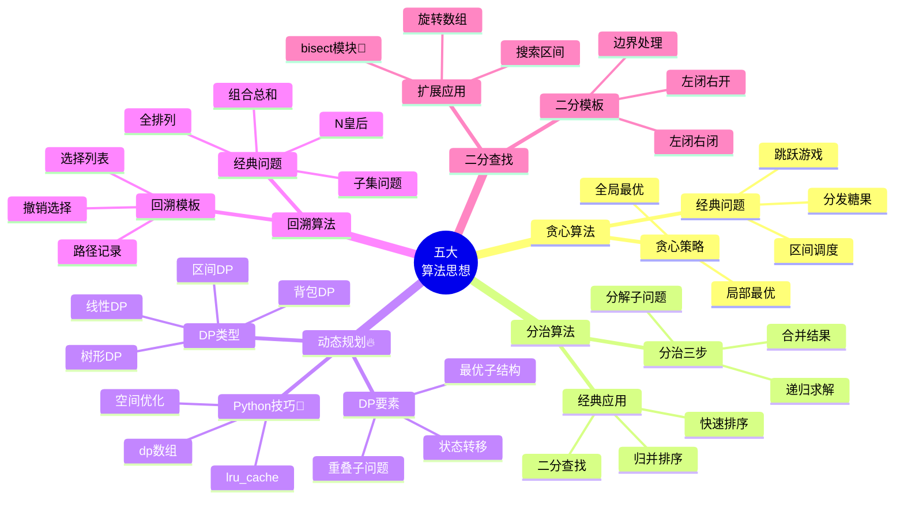

# 🧠 算法思想脑图

> 🐍 Python专属 | 五大算法思想是解题的核心武器，掌握后可以举一反三

---

## 📊 整体架构思维导图



---

## 💰 一、贪心算法 Greedy

### 1.1 贪心思想核心

**核心**: 每一步都做当前看起来最优的选择，期望得到全局最优解

**适用场景**:
- ✅ 局部最优能推导出全局最优
- ✅ 问题具有贪心选择性质
- ❌ 不适合有后效性的问题（用DP）

### 1.2 经典贪心题型

#### 📌 区间调度问题

```python
# 无重叠区间 - 按结束时间排序🐍
def erase_overlap_intervals(intervals):
    if not intervals:
        return 0
    
    # 按结束时间排序
    intervals.sort(key=lambda x: x[1])
    count = 0
    end = intervals[0][1]
    
    for i in range(1, len(intervals)):
        if intervals[i][0] < end:  # 有重叠
            count += 1
        else:
            end = intervals[i][1]
    
    return count
```

#### 📌 跳跃游戏

```python
# 跳跃游戏II - 贪心找最远边界
def jump(nums):
    n = len(nums)
    if n == 1:
        return 0
    
    jumps = 0
    current_max = 0  # 当前跳跃的最远边界
    next_max = 0     # 下一次跳跃的最远边界
    
    for i in range(n - 1):
        next_max = max(next_max, i + nums[i])
        if i == current_max:  # 到达当前边界
            jumps += 1
            current_max = next_max
            if current_max >= n - 1:
                break
    
    return jumps
```

#### 📌 分发糖果

```python
# 分发糖果 - 两次遍历🔥
def candy(ratings):
    n = len(ratings)
    candies = [1] * n
    
    # 从左到右，保证右边评分高的糖果多
    for i in range(1, n):
        if ratings[i] > ratings[i-1]:
            candies[i] = candies[i-1] + 1
    
    # 从右到左，保证左边评分高的糖果多
    for i in range(n-2, -1, -1):
        if ratings[i] > ratings[i+1]:
            candies[i] = max(candies[i], candies[i+1] + 1)
    
    return sum(candies)
```

---

## ⚡ 二、分治算法 Divide and Conquer

### 2.1 分治三步曲

1. **分解**: 将问题分解成若干个规模更小的子问题
2. **解决**: 递归求解各个子问题
3. **合并**: 将子问题的解合并成原问题的解

### 2.2 经典分治应用

#### 📌 归并排序🔥

```python
def merge_sort(nums):
    if len(nums) <= 1:
        return nums
    
    # 分解
    mid = len(nums) // 2
    left = merge_sort(nums[:mid])
    right = merge_sort(nums[mid:])
    
    # 合并
    return merge(left, right)

def merge(left, right):
    result = []
    i = j = 0
    
    while i < len(left) and j < len(right):
        if left[i] <= right[j]:
            result.append(left[i])
            i += 1
        else:
            result.append(right[j])
            j += 1
    
    result.extend(left[i:])
    result.extend(right[j:])
    return result
```

#### 📌 快速排序

```python
def quick_sort(nums):
    if len(nums) <= 1:
        return nums
    
    pivot = nums[len(nums) // 2]
    # Python列表推导式🐍
    left = [x for x in nums if x < pivot]
    middle = [x for x in nums if x == pivot]
    right = [x for x in nums if x > pivot]
    
    return quick_sort(left) + middle + quick_sort(right)

# 原地快排（更省空间）
def quick_sort_inplace(nums, left, right):
    if left >= right:
        return
    
    pivot_idx = partition(nums, left, right)
    quick_sort_inplace(nums, left, pivot_idx - 1)
    quick_sort_inplace(nums, pivot_idx + 1, right)

def partition(nums, left, right):
    pivot = nums[right]
    i = left
    for j in range(left, right):
        if nums[j] < pivot:
            nums[i], nums[j] = nums[j], nums[i]
            i += 1
    nums[i], nums[right] = nums[right], nums[i]
    return i
```

---

## 🔥 三、动态规划 DP（重中之重）

### 3.1 DP核心要素

1. **重叠子问题**: 子问题会被重复计算
2. **最优子结构**: 问题的最优解包含子问题的最优解
3. **状态转移方程**: 描述状态之间的关系

### 3.2 DP解题四步

1. **定义状态**: `dp[i]` 代表什么
2. **初始化**: `dp[0]` 等边界值
3. **状态转移**: 找递推关系
4. **返回结果**: `dp[n]` 或其他

### 3.3 线性DP

#### 📌 爬楼梯（DP入门）

```python
# 方法1: 记忆化搜索🐍
from functools import lru_cache

@lru_cache(maxsize=None)
def climb_stairs(n):
    if n <= 2:
        return n
    return climb_stairs(n-1) + climb_stairs(n-2)

# 方法2: 自底向上DP
def climb_stairs_dp(n):
    if n <= 2:
        return n
    dp = [0] * (n + 1)
    dp[1], dp[2] = 1, 2
    for i in range(3, n + 1):
        dp[i] = dp[i-1] + dp[i-2]
    return dp[n]

# 方法3: 空间优化🐍
def climb_stairs_optimized(n):
    if n <= 2:
        return n
    prev, curr = 1, 2
    for _ in range(3, n + 1):
        prev, curr = curr, prev + curr
    return curr
```

#### 📌 打家劫舍系列

```python
# 打家劫舍I
def rob(nums):
    if not nums:
        return 0
    if len(nums) == 1:
        return nums[0]
    
    # dp[i] = max(不偷i, 偷i)
    prev, curr = 0, nums[0]
    for i in range(1, len(nums)):
        prev, curr = curr, max(curr, prev + nums[i])
    return curr

# 打家劫舍II（环形）🔥
def rob2(nums):
    if len(nums) == 1:
        return nums[0]
    
    def rob_range(start, end):
        prev, curr = 0, 0
        for i in range(start, end):
            prev, curr = curr, max(curr, prev + nums[i])
        return curr
    
    # 要么不偷第一家，要么不偷最后一家
    return max(rob_range(0, len(nums)-1), rob_range(1, len(nums)))
```

### 3.4 背包DP🔥

#### 📌 0-1背包（完整模板）

```python
def knapsack_01(weights, values, capacity):
    n = len(weights)
    # dp[i][w] = 前i个物品，容量w时的最大价值
    dp = [[0] * (capacity + 1) for _ in range(n + 1)]
    
    for i in range(1, n + 1):
        for w in range(capacity + 1):
            # 不选第i个物品
            dp[i][w] = dp[i-1][w]
            # 选第i个物品（如果放得下）
            if w >= weights[i-1]:
                dp[i][w] = max(dp[i][w], 
                              dp[i-1][w - weights[i-1]] + values[i-1])
    
    return dp[n][capacity]

# 空间优化版本🐍
def knapsack_01_optimized(weights, values, capacity):
    dp = [0] * (capacity + 1)
    
    for i in range(len(weights)):
        # 必须倒序遍历，避免重复选择
        for w in range(capacity, weights[i] - 1, -1):
            dp[w] = max(dp[w], dp[w - weights[i]] + values[i])
    
    return dp[capacity]
```

#### 📌 完全背包

```python
def knapsack_complete(weights, values, capacity):
    dp = [0] * (capacity + 1)
    
    for i in range(len(weights)):
        # 正序遍历，允许重复选择
        for w in range(weights[i], capacity + 1):
            dp[w] = max(dp[w], dp[w - weights[i]] + values[i])
    
    return dp[capacity]
```

### 3.5 最长子序列问题

#### 📌 最长递增子序列 LIS🔥

```python
# 方法1: DP O(n²)
def length_of_lis(nums):
    if not nums:
        return 0
    
    n = len(nums)
    dp = [1] * n  # dp[i] = 以nums[i]结尾的LIS长度
    
    for i in range(1, n):
        for j in range(i):
            if nums[j] < nums[i]:
                dp[i] = max(dp[i], dp[j] + 1)
    
    return max(dp)

# 方法2: 二分 + 贪心 O(n log n)🐍
import bisect

def length_of_lis_binary(nums):
    tails = []  # tails[i] = 长度为i+1的LIS的最小尾元素
    
    for num in nums:
        pos = bisect.bisect_left(tails, num)
        if pos == len(tails):
            tails.append(num)
        else:
            tails[pos] = num
    
    return len(tails)
```

---

## 🔄 四、回溯算法 Backtracking

### 4.1 回溯模板🔥

```python
def backtrack(路径, 选择列表):
    if 满足结束条件:
        result.append(路径.copy())
        return
    
    for 选择 in 选择列表:
        # 做选择
        路径.add(选择)
        
        # 递归
        backtrack(路径, 新的选择列表)
        
        # 撤销选择
        路径.remove(选择)
```

### 4.2 经典回溯题

#### 📌 全排列🔥

```python
def permute(nums):
    result = []
    
    def backtrack(path, used):
        if len(path) == len(nums):
            result.append(path[:])  # 复制路径🐍
            return
        
        for i in range(len(nums)):
            if used[i]:
                continue
            
            # 做选择
            path.append(nums[i])
            used[i] = True
            
            # 递归
            backtrack(path, used)
            
            # 撤销选择
            path.pop()
            used[i] = False
    
    backtrack([], [False] * len(nums))
    return result
```

#### 📌 组合总和

```python
def combination_sum(candidates, target):
    result = []
    
    def backtrack(start, path, total):
        if total == target:
            result.append(path[:])
            return
        if total > target:
            return
        
        for i in range(start, len(candidates)):
            path.append(candidates[i])
            # 允许重复使用，所以还是从i开始
            backtrack(i, path, total + candidates[i])
            path.pop()
    
    backtrack(0, [], 0)
    return result
```

#### 📌 子集问题🐍

```python
def subsets(nums):
    result = []
    
    def backtrack(start, path):
        result.append(path[:])  # 每个节点都是答案
        
        for i in range(start, len(nums)):
            path.append(nums[i])
            backtrack(i + 1, path)
            path.pop()
    
    backtrack(0, [])
    return result
```

---

## 🔍 五、二分查找 Binary Search

### 5.1 二分查找模板🔥

```python
# 模板1: 左闭右闭 [left, right]
def binary_search(nums, target):
    left, right = 0, len(nums) - 1
    
    while left <= right:  # 注意等号
        mid = left + (right - left) // 2
        if nums[mid] == target:
            return mid
        elif nums[mid] < target:
            left = mid + 1
        else:
            right = mid - 1
    
    return -1

# 模板2: 左闭右开 [left, right)
def binary_search_v2(nums, target):
    left, right = 0, len(nums)
    
    while left < right:  # 没有等号
        mid = left + (right - left) // 2
        if nums[mid] == target:
            return mid
        elif nums[mid] < target:
            left = mid + 1
        else:
            right = mid  # 注意这里
    
    return -1
```

### 5.2 二分查找边界

```python
# 查找左边界（第一个>=target的位置）
def lower_bound(nums, target):
    left, right = 0, len(nums)
    while left < right:
        mid = left + (right - left) // 2
        if nums[mid] < target:
            left = mid + 1
        else:
            right = mid
    return left

# 查找右边界（最后一个<=target的位置）
def upper_bound(nums, target):
    left, right = 0, len(nums)
    while left < right:
        mid = left + (right - left) // 2
        if nums[mid] <= target:
            left = mid + 1
        else:
            right = mid
    return left - 1
```

### 5.3 Python bisect 模块🐍

```python
import bisect

nums = [1, 3, 3, 3, 5, 7]

# bisect_left: 查找插入位置（左边界）
pos_left = bisect.bisect_left(nums, 3)  # 1

# bisect_right: 查找插入位置（右边界）
pos_right = bisect.bisect_right(nums, 3)  # 4

# insort: 插入并保持有序
bisect.insort(nums, 4)  # [1, 3, 3, 3, 4, 5, 7]
```

---

## 🎯 经典题目汇总

### 💰 贪心算法

| 题号 | 题目 | 难度 | 核心技巧 |
|------|------|------|---------|
| 455 | 分发饼干 | ⭐ | 排序 + 贪心 |
| 435 | 无重叠区间 | ⭐⭐ | 按结束时间排序🔥 |
| 45 | 跳跃游戏II | ⭐⭐ | 贪心边界 |
| 135 | 分发糖果 | ⭐⭐⭐ | 两次遍历🔥 |

### 🔥 动态规划

| 题号 | 题目 | 难度 | 核心技巧 |
|------|------|------|---------|
| 70 | 爬楼梯 | ⭐ | lru_cache🐍 |
| 198 | 打家劫舍 | ⭐⭐ | 线性DP |
| 213 | 打家劫舍II | ⭐⭐ | 环形处理🔥 |
| 300 | 最长递增子序列 | ⭐⭐ | bisect优化🐍 |
| 322 | 零钱兑换 | ⭐⭐ | 完全背包 |
| 518 | 零钱兑换II | ⭐⭐ | 完全背包 |

### 🔄 回溯算法

| 题号 | 题目 | 难度 | 核心技巧 |
|------|------|------|---------|
| 46 | 全排列 | ⭐⭐ | 回溯模板🔥 |
| 78 | 子集 | ⭐⭐ | 回溯🐍 |
| 39 | 组合总和 | ⭐⭐ | 回溯 + 剪枝 |
| 51 | N皇后 | ⭐⭐⭐ | 回溯 |

### 🔍 二分查找

| 题号 | 题目 | 难度 | 核心技巧 |
|------|------|------|---------|
| 704 | 二分查找 | ⭐ | 基础模板 |
| 34 | 在排序数组中查找元素的第一个和最后一个位置 | ⭐⭐ | 边界二分🔥 |
| 33 | 搜索旋转排序数组 | ⭐⭐ | 分段二分 |

---

## 📝 学习建议

### 🎯 学习顺序
1. **贪心算法**: 先做简单题找感觉
2. **二分查找**: 掌握模板，注意边界
3. **回溯算法**: 背模板，多练习
4. **动态规划**: 重点攻克，多刷题

### 🔥 重点掌握
- ✅ DP的 `lru_cache` 装饰器🐍
- ✅ 背包问题的空间优化
- ✅ 回溯的剪枝技巧
- ✅ `bisect` 模块的使用🐍

### 🐍 Python特色技巧
```python
# 1. 记忆化装饰器
from functools import lru_cache
@lru_cache(maxsize=None)
def fib(n):
    return n if n <= 1 else fib(n-1) + fib(n-2)

# 2. 列表推导式（快速分治）
left = [x for x in nums if x < pivot]

# 3. bisect 二分模块
import bisect
pos = bisect.bisect_left(nums, target)

# 4. 多变量同时赋值
prev, curr = curr, prev + curr
```

---

## 🔗 相关文件链接

- 📖 [动态规划完全指南](../knowledge/11-动态规划.md)
- 📖 [回溯算法详解](../knowledge/10-回溯算法.md)
- 📖 [贪心算法](../knowledge/08-贪心算法.md)
- 💻 [DP代码模板](../templates/DP模板.md)
- 💻 [回溯代码模板](../templates/回溯模板.md)
- 📋 [必刷题目清单](../practice/必刷题目清单.md)

**🎯 掌握这五大算法思想，70%的算法题都能解决！**
