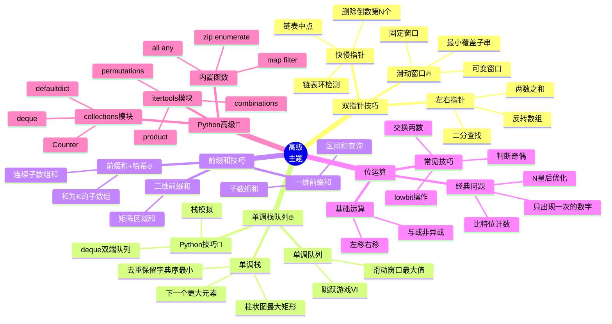

# ⚡ 高级主题脑图

> 🐍 Python专属 | 高级技巧是面试加分项,掌握后能解决难题

---

## 📊 整体架构思维导图



---

## 👉 一、双指针技巧

### 1.1 快慢指针（链表专用）

#### 📌 检测环🔥

```python
def has_cycle(head):
    if not head or not head.next:
        return False
    
    slow = fast = head
    while fast and fast.next:
        slow = slow.next
        fast = fast.next.next
        if slow == fast:
            return True
    return False

# 找环的起点
def detect_cycle(head):
    slow = fast = head
    
    # 先找到相遇点
    while fast and fast.next:
        slow = slow.next
        fast = fast.next.next
        if slow == fast:
            break
    else:
        return None  # 没有环
    
    # 一个指针回到起点，同速前进
    slow = head
    while slow != fast:
        slow = slow.next
        fast = fast.next
    return slow
```

#### 📌 找链表中点

```python
def find_middle(head):
    slow = fast = head
    while fast and fast.next:
        slow = slow.next
        fast = fast.next.next
    return slow  # slow指向中点
```

#### 📌 删除倒数第N个节点

```python
def remove_nth_from_end(head, n):
    dummy = ListNode(0)
    dummy.next = head
    slow = fast = dummy
    
    # fast先走n步
    for _ in range(n):
        fast = fast.next
    
    # 同速前进
    while fast.next:
        slow = slow.next
        fast = fast.next
    
    # 删除slow.next
    slow.next = slow.next.next
    return dummy.next
```

### 1.2 左右指针（数组专用）

#### 📌 两数之和II（有序数组）

```python
def two_sum(numbers, target):
    left, right = 0, len(numbers) - 1
    
    while left < right:
        total = numbers[left] + numbers[right]
        if total == target:
            return [left + 1, right + 1]  # 1-indexed
        elif total < target:
            left += 1
        else:
            right -= 1
    return []
```

#### 📌 三数之和🔥

```python
def three_sum(nums):
    nums.sort()
    result = []
    n = len(nums)
    
    for i in range(n - 2):
        # 跳过重复元素
        if i > 0 and nums[i] == nums[i-1]:
            continue
        
        # 双指针找另外两个数
        left, right = i + 1, n - 1
        target = -nums[i]
        
        while left < right:
            total = nums[left] + nums[right]
            if total == target:
                result.append([nums[i], nums[left], nums[right]])
                # 跳过重复
                while left < right and nums[left] == nums[left+1]:
                    left += 1
                while left < right and nums[right] == nums[right-1]:
                    right -= 1
                left += 1
                right -= 1
            elif total < target:
                left += 1
            else:
                right -= 1
    
    return result
```

### 1.3 滑动窗口🔥

#### 📌 滑动窗口模板

```python
from collections import defaultdict

def sliding_window(s, t):
    need = defaultdict(int)  # 需要的字符及数量🐍
    window = defaultdict(int)  # 窗口中的字符及数量
    
    for char in t:
        need[char] += 1
    
    left = right = 0
    valid = 0  # 窗口中满足need条件的字符个数
    
    while right < len(s):
        # 扩大窗口
        char = s[right]
        right += 1
        
        # 更新窗口数据
        if char in need:
            window[char] += 1
            if window[char] == need[char]:
                valid += 1
        
        # 判断是否需要收缩窗口
        while 窗口需要收缩:
            # 缩小窗口前，更新结果
            
            # 缩小窗口
            d = s[left]
            left += 1
            
            # 更新窗口数据
            if d in need:
                if window[d] == need[d]:
                    valid -= 1
                window[d] -= 1
```

#### 📌 最小覆盖子串🔥

```python
from collections import defaultdict

def min_window(s, t):
    need = defaultdict(int)
    window = defaultdict(int)
    
    for char in t:
        need[char] += 1
    
    left = right = 0
    valid = 0
    start = 0
    min_len = float('inf')
    
    while right < len(s):
        char = s[right]
        right += 1
        
        if char in need:
            window[char] += 1
            if window[char] == need[char]:
                valid += 1
        
        # 收缩窗口
        while valid == len(need):
            # 更新最小长度
            if right - left < min_len:
                start = left
                min_len = right - left
            
            d = s[left]
            left += 1
            
            if d in need:
                if window[d] == need[d]:
                    valid -= 1
                window[d] -= 1
    
    return "" if min_len == float('inf') else s[start:start+min_len]
```

---

## 📊 二、单调栈和单调队列

### 2.1 单调栈🔥

#### 📌 下一个更大元素

```python
def next_greater_element(nums):
    n = len(nums)
    result = [-1] * n
    stack = []  # 存储下标
    
    for i in range(n):
        # 栈顶元素小于当前元素，找到了更大的
        while stack and nums[stack[-1]] < nums[i]:
            result[stack.pop()] = nums[i]
        stack.append(i)
    
    return result

# 循环数组版本🐍
def next_greater_elements_circular(nums):
    n = len(nums)
    result = [-1] * n
    stack = []
    
    # 遍历两遍数组
    for i in range(2 * n):
        num = nums[i % n]
        while stack and nums[stack[-1]] < num:
            result[stack.pop()] = num
        if i < n:
            stack.append(i)
    
    return result
```

#### 📌 柱状图中最大的矩形🔥

```python
def largest_rectangle_area(heights):
    stack = []
    max_area = 0
    heights = [0] + heights + [0]  # 哨兵技巧🐍
    
    for i, h in enumerate(heights):
        while stack and heights[stack[-1]] > h:
            height = heights[stack.pop()]
            width = i - stack[-1] - 1
            max_area = max(max_area, height * width)
        stack.append(i)
    
    return max_area
```

### 2.2 单调队列🔥

#### 📌 滑动窗口最大值

```python
from collections import deque

def max_sliding_window(nums, k):
    dq = deque()  # 存储下标🐍
    result = []
    
    for i, num in enumerate(nums):
        # 移除窗口外的元素
        if dq and dq[0] < i - k + 1:
            dq.popleft()
        
        # 保持单调递减，移除比当前小的
        while dq and nums[dq[-1]] < num:
            dq.pop()
        
        dq.append(i)
        
        # 窗口形成后，记录最大值
        if i >= k - 1:
            result.append(nums[dq[0]])
    
    return result
```

---

## 🔢 三、前缀和技巧

### 3.1 一维前缀和

```python
# 构建前缀和数组
def build_prefix_sum(nums):
    n = len(nums)
    prefix = [0] * (n + 1)
    for i in range(n):
        prefix[i+1] = prefix[i] + nums[i]
    return prefix

# 查询区间和 [left, right]
def range_sum(prefix, left, right):
    return prefix[right+1] - prefix[left]
```

### 3.2 前缀和 + 哈希表🔥

#### 📌 和为K的子数组

```python
from collections import defaultdict

def subarray_sum(nums, k):
    # prefix_sum[i] = 前i个元素的和
    count = 0
    prefix_sum = 0
    prefix_count = defaultdict(int)
    prefix_count[0] = 1  # 初始化🐍
    
    for num in nums:
        prefix_sum += num
        # 找有多少个前缀和 = prefix_sum - k
        count += prefix_count[prefix_sum - k]
        prefix_count[prefix_sum] += 1
    
    return count
```

#### 📌 连续的子数组和（同余定理）🔥

```python
def check_subarray_sum(nums, k):
    # (prefix[j] - prefix[i]) % k == 0
    # 等价于 prefix[j] % k == prefix[i] % k
    
    remainder_index = {0: -1}  # 余数 -> 最早出现的下标🐍
    prefix_sum = 0
    
    for i, num in enumerate(nums):
        prefix_sum += num
        remainder = prefix_sum % k
        
        if remainder in remainder_index:
            if i - remainder_index[remainder] >= 2:
                return True
        else:
            remainder_index[remainder] = i
    
    return False
```

### 3.3 二维前缀和

```python
# 构建二维前缀和
def build_2d_prefix(matrix):
    m, n = len(matrix), len(matrix[0])
    prefix = [[0] * (n + 1) for _ in range(m + 1)]
    
    for i in range(1, m + 1):
        for j in range(1, n + 1):
            prefix[i][j] = (matrix[i-1][j-1] + 
                           prefix[i-1][j] + 
                           prefix[i][j-1] - 
                           prefix[i-1][j-1])
    return prefix

# 查询矩形区域和 [(r1,c1), (r2,c2)]
def region_sum(prefix, r1, c1, r2, c2):
    return (prefix[r2+1][c2+1] - 
            prefix[r1][c2+1] - 
            prefix[r2+1][c1] + 
            prefix[r1][c1])
```

---

## 🔣 四、位运算

### 4.1 基础位运算

```python
# 判断奇偶
is_odd = (n & 1) == 1

# 交换两数（不用临时变量）
a ^= b
b ^= a
a ^= b

# 获取最低位的1（lowbit）
lowbit = n & (-n)

# 消除最低位的1
n = n & (n - 1)

# 判断是否为2的幂
is_power_of_2 = (n > 0) and (n & (n - 1)) == 0
```

### 4.2 经典位运算题

#### 📌 只出现一次的数字

```python
# 其他数字出现2次
def single_number(nums):
    result = 0
    for num in nums:
        result ^= num  # 异或
    return result

# 其他数字出现3次🔥
def single_number_three_times(nums):
    ones = twos = 0
    for num in nums:
        ones = (ones ^ num) & ~twos
        twos = (twos ^ num) & ~ones
    return ones
```

#### 📌 比特位计数

```python
# 计算0到n每个数的1的个数🐍
def count_bits(n):
    # dp[i] = dp[i >> 1] + (i & 1)
    dp = [0] * (n + 1)
    for i in range(1, n + 1):
        dp[i] = dp[i >> 1] + (i & 1)
    return dp
```

---

## 🐍 五、Python高级技巧

### 5.1 内置函数🐍

```python
# map - 映射
nums = [1, 2, 3, 4]
squares = list(map(lambda x: x**2, nums))  # [1, 4, 9, 16]

# filter - 过滤
evens = list(filter(lambda x: x % 2 == 0, nums))  # [2, 4]

# zip - 打包
a = [1, 2, 3]
b = ['a', 'b', 'c']
pairs = list(zip(a, b))  # [(1, 'a'), (2, 'b'), (3, 'c')]

# enumerate - 枚举
for i, val in enumerate(['a', 'b', 'c']):
    print(f'{i}: {val}')

# all / any - 全部/任一
all([True, True, False])  # False
any([True, False, False])  # True
```

### 5.2 collections 模块🐍

```python
from collections import Counter, defaultdict, deque

# Counter - 计数器🔥
nums = [1, 2, 2, 3, 3, 3]
counter = Counter(nums)  # Counter({3: 3, 2: 2, 1: 1})
most_common = counter.most_common(2)  # [(3, 3), (2, 2)]

# defaultdict - 默认字典🔥
graph = defaultdict(list)
graph[1].append(2)  # 自动创建空列表

# deque - 双端队列🔥
dq = deque([1, 2, 3])
dq.append(4)      # 右端添加
dq.appendleft(0)  # 左端添加
dq.pop()          # 右端弹出
dq.popleft()      # 左端弹出
```

### 5.3 itertools 模块🐍

```python
from itertools import combinations, permutations, product

# combinations - 组合
list(combinations([1,2,3], 2))  # [(1,2), (1,3), (2,3)]

# permutations - 排列
list(permutations([1,2,3], 2))  # [(1,2), (1,3), (2,1), (2,3), (3,1), (3,2)]

# product - 笛卡尔积
list(product([1,2], ['a','b']))  # [(1,'a'), (1,'b'), (2,'a'), (2,'b')]

# accumulate - 累积🔥
from itertools import accumulate
list(accumulate([1,2,3,4]))  # [1, 3, 6, 10] (前缀和)
```

---

## 🎯 经典题目汇总

### 👉 双指针

| 题号 | 题目 | 难度 | 核心技巧 |
|------|------|------|---------|
| 141 | 环形链表 | ⭐ | 快慢指针🔥 |
| 142 | 环形链表II | ⭐⭐ | 快慢指针找起点 |
| 15 | 三数之和 | ⭐⭐ | 双指针🔥 |
| 76 | 最小覆盖子串 | ⭐⭐⭐ | 滑动窗口🔥 |

### 📊 单调栈队列

| 题号 | 题目 | 难度 | 核心技巧 |
|------|------|------|---------|
| 496 | 下一个更大元素I | ⭐ | 单调栈🔥 |
| 84 | 柱状图中最大的矩形 | ⭐⭐⭐ | 单调栈 + 哨兵🐍 |
| 239 | 滑动窗口最大值 | ⭐⭐⭐ | 单调队列🔥 |

### 🔢 前缀和

| 题号 | 题目 | 难度 | 核心技巧 |
|------|------|------|---------|
| 560 | 和为K的子数组 | ⭐⭐ | 前缀和 + 哈希🔥 |
| 523 | 连续的子数组和 | ⭐⭐ | 同余定理🔥 |

### 🔣 位运算

| 题号 | 题目 | 难度 | 核心技巧 |
|------|------|------|---------|
| 136 | 只出现一次的数字 | ⭐ | 异或🔥 |
| 338 | 比特位计数 | ⭐ | DP + 位运算🐍 |

---

## 📝 学习建议

### 🎯 学习顺序
1. **双指针**: 先掌握快慢指针和左右指针
2. **滑动窗口**: 背模板，理解扩大和收缩条件
3. **单调栈队列**: 理解单调性的维护
4. **前缀和**: 掌握前缀和+哈希的技巧

### 🔥 重点掌握
- ✅ 滑动窗口模板🔥
- ✅ 单调栈的应用场景
- ✅ 前缀和+哈希表的组合
- ✅ Python collections 模块🐍

### 🐍 Python特色技巧
```python
# 1. defaultdict简化代码
from collections import defaultdict
need = defaultdict(int)  # 不用初始化

# 2. deque实现单调队列
from collections import deque
dq = deque()
dq.append(x)      # O(1)
dq.popleft()      # O(1)

# 3. Counter快速计数
from collections import Counter
counter = Counter(nums)
most_common = counter.most_common(k)

# 4. 列表推导式
result = [x for x in nums if x > 0]
```

---

## 🔗 相关文件链接

- 📖 [双指针技巧详解](../algorithms/双指针技巧.md)
- 📖 [滑动窗口专题](../algorithms/滑动窗口.md)
- 📖 [单调栈队列](../algorithms/单调栈队列.md)
- 💻 [滑动窗口模板](../templates/滑动窗口模板.md)
- 📋 [必刷题目清单](../practice/必刷题目清单.md)

**🎯 掌握这些高级技巧,面试难题也能轻松解决！**
